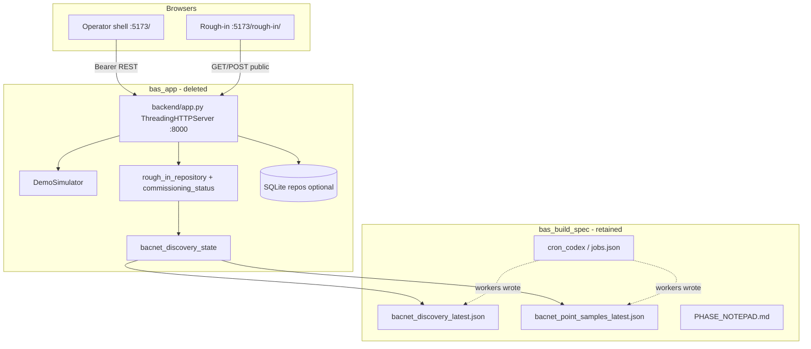

# bas_app — retired experiment archive (2026-05-18)

**Location (deleted):** `/home/ben/bas_app`  
**Built by:** Codex CLI incremental wakes (`bas_wake.sh`) against `vibe_code_apps_11/bas_build_spec/`  
**Orchestration:** `bas_build_spec/cron_codex/`, `cron/jobs.json` (cron was paused before retirement)  
**Retired:** 2026-05-18 — directory removed; user systemd units removed. Spec/skills remain the source of truth for a future rebuild.

Commissioning chat export: `memory/architecture/bas_app-archive-2026-05-18/rough_in_chat.json`

---

## Executive summary

`bas_app` was a **lab/demo BAS supervisory head-end**: Python **stdlib HTTP** API on port **8000**, static HTML/JS on **5173**, **simulator-first** live data on `/`, plus a **no-login public rough-in** slice at `/rough-in/` that read real BACnet discovery/point-scrape JSON from `bas_build_spec/memory/integrations/` when wire was authorized. It was **not** a production ASGI/React deployment.

---

## Technology stack

| Layer | Choice | Notes |
|-------|--------|--------|
| **Backend runtime** | Python 3.12+ | `python3 -m backend` |
| **HTTP server** | `http.server.ThreadingHTTPServer` | Monolithic `BASRequestHandler` in `backend/app.py` (~1.4k LOC) |
| **Web framework** | None | No FastAPI/Flask/Django |
| **Database** | SQLite (optional) | `BAS_DB_PATH` → repos for audit, auth, alarms, schedules, trends, catalog |
| **Live demo state** | In-process `DemoSimulator` | Default path for points, alarms, dynamics |
| **BACnet OT** | External scripts + JSON files | Not embedded driver; `bacnet_discovery_state.py` reads `bas_build_spec` memory |
| **Frontend** | Vanilla HTML/CSS/JS | No React/Vite build; `node --check` only |
| **Frontend serve** | `python3 -m http.server 5173` | Or `frontend/serve.sh` |
| **E2E tests** | Playwright 1.54 (`@playwright/test`) | Dev dependency in `package.json` |
| **Unit tests** | `pytest` (stdlib `unittest` style in `backend/tests/`) | |
| **BACnet lab venv** | `bas_app/.venv` + `bacpypes3` | Used by **cron workers** (`bas_bacnet_*`), not required for HTTP server |
| **Containers** | Docker Compose (`deploy/compose.yaml`) | Same commands as bare metal |
| **Process supervision (optional)** | systemd user units | `bas-backend.service`, `bas-frontend.service` — **removed 2026-05-18** |
| **Dev stack script** | `scripts/local_stack.sh` | PID files under `/tmp/bas_app`; used by `POST_WAKE_HOOK` / manual ops |

---

## Architecture (logical)



**Boundary rule:** Codex owned `bas_app/`; Cursor owned `bas_build_spec/` (spec, skills, cron, validation).

---

## Backend modules

| Module | Responsibility |
|--------|----------------|
| `app.py` | All routes, CORS, auth gate, CSV exports, public rough-in snapshot assembly |
| `simulator.py` | Seeded site tree, live values, alarm/comm dynamics |
| `building_program.py` | Template registry (`hybrid_office`, `vrf_doas`) |
| `auth.py` / `auth_repository.py` | PBKDF2 demo users, in-memory bearer tokens |
| `command_service.py` | Simulator-only writes with audit |
| `alarm_service.py` / `alarm_repository.py` | Ack/shelve, optional DB persist |
| `schedule_service.py` / `schedule_repository.py` | Schedule CRUD |
| `point_service.py` | Point read aggregation |
| `trend_repository.py` | Trend samples |
| `catalog_repository.py` | Site/equipment catalog snapshot |
| `audit_repository.py` | Command/audit trail |
| `db.py` / `init_db.py` | SQLite schema bootstrap |
| `rough_in_repository.py` | `runtime/rough_in_chat.json` persistence |
| `commissioning_status.py` | Chat POST handling, wake schedule text |
| `bacnet_discovery_state.py` | `build_device_tree()`, wire gate, integration JSON loaders |
| `wake_schedule.py` | Format automation ETA block for operator UI |

---

## HTTP API surface

**Public (no auth)**

| Method | Path | Purpose |
|--------|------|---------|
| GET | `/health` | Liveness + simulator flag |
| GET/POST | `/api/public/rough-in` | Phase 1 commissioning snapshot + chat |

**Protected (Bearer token after `POST /api/auth/login`)**

| Area | Paths |
|------|--------|
| Auth | `/api/auth/login`, `/api/me` |
| Site / program | `/api/demo/site`, `/api/building-program` |
| Points | `/api/points`, `/api/points/{id}`, `/api/points/update` |
| Commands | `/api/commands`, `/api/commands/release` |
| Alarms | `/api/alarms`, ack/shelve, export CSV |
| Schedules | `/api/schedules`, update, exception |
| Trends | `/api/trends`, export CSV |
| Reports | `/api/reports/summary` |
| Audit | `/api/audit/events`, CSV export |

**Environment**

- `BAS_BIND_HOST` / `BAS_BIND_PORT` (default `0.0.0.0:8000`)
- `BAS_ALLOWED_ORIGINS` — CORS for LAN UI origin
- `BAS_DB_PATH` — optional SQLite
- `BAS_BUILDING_PROGRAM_TEMPLATE` — `hybrid_office` | `vrf_doas`

---

## Frontend surfaces

| Path | Files | Audience |
|------|-------|----------|
| `/` | `frontend/index.html`, `app.js`, `styles.css` | Logged-in operator demo (tree, graphic, points, alarms, trends, schedules) |
| `/rough-in/` | `frontend/rough-in/*` | Electrician Phase 1 — chat, BACnet bind/NIC, device tree, collapsed proof `<details>` |

Theme aligned with `bas_build_spec/frontend_example/graphic.html` (dark BAS tokens, light mode toggle on rough-in).

---

## What Codex delivered (commissioning experiment)

1. **Supervisor demo shell** — full simulator workflows behind login.
2. **Public rough-in** — read-only wire integration when `BUILD_CHECKPOINTS` BACnet sign-off + discovery JSON present.
3. **Device tree** — bind → device → point leaves from `bacnet_point_samples_latest.json` (no collapse UI; expanded nested lists).
4. **Chat persistence** — `runtime/rough_in_chat.json`; worker poll noise filtered from operator view.
5. **Smoke/validation** — extensive `scripts/smoke_*.sh`, Playwright `tests/frontend_smoke.spec.mjs`, pytest backend suite.
6. **Optional systemd** — user units pointing at `bas_app` (removed on retirement; **local_stack.sh** was the path Codex/post-wake often used instead).

**Known gaps (documented at retirement):** no ASGI, no SPA build, no WebSockets, monolithic handler, public POST without network ACL, tree not collapsible, dashboard still multi-card.

---

## Runtime mechanisms (what kept it up)

| Mechanism | Role |
|-----------|------|
| **`scripts/local_stack.sh`** | Primary lab launcher (backend + frontend PIDs, logs under `/tmp/bas_app`) |
| **`POST_WAKE_HOOK`** | Could call `bas_post_wake_stack.sh` → stack restart after Codex wake |
| **systemd user** | `bas-backend.service` / `bas-frontend.service` — optional, were **inactive** at retirement |
| **Cron** | Was paused; workers did not require `bas_app` except optional `.venv` python for BACnet scripts |

---

## File tree (79 tracked source files; excludes `.venv`, caches)

```text
bas_app/
├── README.md
├── README.BLASTED.md          # stub from earlier nuke (2026-05-12)
├── package.json               # Playwright devDep only
├── package-lock.json
├── .gitignore
├── backend/
│   ├── __init__.py
│   ├── __main__.py              # python3 -m backend
│   ├── app.py                   # HTTP server + all routes
│   ├── simulator.py
│   ├── building_program.py
│   ├── auth.py
│   ├── auth_repository.py
│   ├── command_service.py
│   ├── point_service.py
│   ├── alarm_service.py
│   ├── alarm_repository.py
│   ├── schedule_service.py
│   ├── schedule_repository.py
│   ├── trend_repository.py
│   ├── catalog_repository.py
│   ├── audit_repository.py
│   ├── db.py
│   ├── init_db.py
│   ├── rough_in_repository.py
│   ├── commissioning_status.py
│   ├── bacnet_discovery_state.py
│   ├── wake_schedule.py
│   ├── README.md
│   └── tests/                   # 14 test modules
├── frontend/
│   ├── index.html
│   ├── app.js
│   ├── styles.css
│   ├── serve.sh
│   ├── README.md
│   └── rough-in/
│       ├── index.html
│       ├── app.js
│       └── styles.css
├── deploy/
│   ├── compose.yaml
│   └── README.md
├── docs/
│   ├── architecture.md
│   └── README.md
├── runtime/
│   ├── rough_in_chat.json       # archived under bas_build_spec
│   └── rough_in_chat_summary.md
├── scripts/
│   ├── local_stack.sh           # start|stop|status
│   ├── post_codex_wake_to_chat.py
│   ├── post_rough_in_chat_report.py
│   ├── print_public_rough_in_proof.py
│   └── smoke_*.sh               # 18 smoke scripts
└── tests/
    └── frontend_smoke.spec.mjs
```

**On disk but excluded from tree:** `.venv/` (bacpypes3 for lab scripts), `.pytest_cache/`, `test-results/`, `node_modules/` (if installed).

---

## Rebuild pointers

- Spec: `bas_build_spec/spec.md`, `acceptance_criteria.md`
- Phase UX contract: `skills/field-commissioning-phases/references/commissioning-phase-dashboards.md`
- Empty app slot: recreate `/home/ben/bas_app` on next Codex wake or manual scaffold
