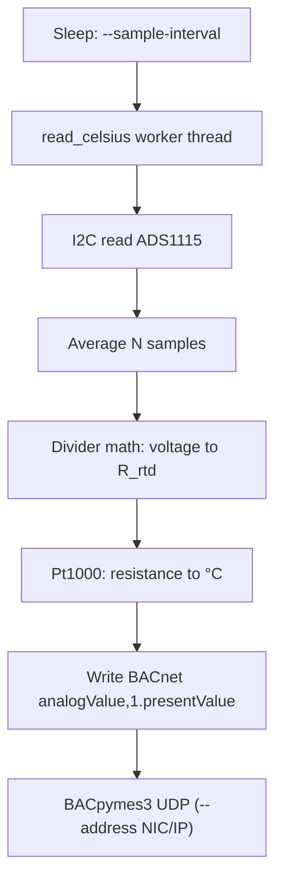

# BACnet Pt1000 RTD Temperature Server

This demo exposes **exactly one** BACnet analog value (`analogValue`, 1) that tracks a Pt1000 element read through a resistor divider measured by an **ADS1115** on I²C. The BACnet stack matches the minimal `mini_weather_device.py` styling in `../vibe_code_apps_4/`, minus the REST/OpenWeather integrations.

Hardware note: Raspberry Pi GPIO does **not** include true analog pins. Analog voltage must come from something like an ADC board (recommended here), a standalone RTD transmitter, or a microcontroller that streams digital readings over USB.

## Raspberry Pi Model B+ wiring (ADS1115 + Pt1000 divider)

The **Model B+** uses the **40‑pin** GPIO header (same pinout idea as later full-size Pi boards). **Pin 1** is at the corner with the **square** copper pad and is **3.3 V**. You are **not** reading the RTD with a “GPIO analog” line: the Pi uses **I²C** to talk to the **ADS1115**, and the ADS1115 performs the **analog** measurement on its `A0` input.

### Step A — ADS1115 breakout to the Pi (power + I²C)

Power **off** while wiring. Use jumpers from the ADS1115 module to the Pi:

| Physical pin (B+ 40‑pin header) | Name   | ADS1115 pin (typical labels) |
|---------------------------------|--------|------------------------------|
| **1**                           | 3.3 V  | `VDD` or `VIN` (see module docs) |
| **3**                           | SDA1   | `SDA` |
| **5**                           | SCL1   | `SCL` |
| **6** (or any `GND`)            | GND    | `GND` |

Only use **5 V** on the ADS1115 if the product page says the board is 5 V safe; many small breakouts are **3.3 V only**.

Enable I²C and confirm the chip answers on the bus:

```bash
sudo raspi-config nonint do_i2c 0
sudo apt install -y i2c-tools
i2cdetect -y 1
```

With default `ADDR` wiring you should see **`48`** in the grid (that is `0x48`).

### Step B — Pt1000 + bias resistor (what `A0` measures)

Build a **two-resistor divider** from the same **3.3 V** you trust for `R_bias`, with the **tap** going to the ADS1115 analog input (channel **0** in code by default):

```text
   Pi 3.3 V (header pin 1)
        |
     [ R_bias ]     ← example: 3300 Ω metal-film; put real value in --r-series-ohms
        |
        +---------- AIN0 / A0+  (single-ended input on your ADS1115 breakout)
        |
     [ Pt1000 ]
        |
       GND  (same GND as Pi pin 6 and ADS1115 GND)
```

Checklist:

- **One continuous ground**: Pi GND, ADS1115 GND, and the bottom of the Pt1000 must be the same reference.
- If your breakout shows `A0+` / `A0-` or `COM`, follow the vendor drawing for single-ended hookup; conceptually you’re always measuring **tap voltage vs ADC ground**.
- Larger **R_bias** → less current → less **self-heating** in the Pt1000 (good for quick bench work).

### Step C — Divider math (for GitHub) + plaintext fallback

GitHub renders display math inside `$$ … $$`:

$$
V_{\text{tap}} = V_{\text{supply}} \cdot \frac{R_{\text{RTD}}}{R_{\text{bias}} + R_{\text{RTD}}}
$$

Solve for Pt1000 resistance (this is what `rtd_sensor.resistance_from_divider()` implements):

$$
R_{\text{RTD}} = R_{\text{bias}} \cdot \frac{V_{\text{tap}}}{V_{\text{supply}} - V_{\text{tap}}}
$$

If formulas do not render in your viewer:

- `V_tap = V_supply * R_rtd / (R_bias + R_rtd)`
- `R_rtd = R_bias * V_tap / (V_supply - V_tap)`

### Practical accuracy notes

1. Prefer a measured value for **`R_bias`** in `--r-series-ohms` (not only the nominal print on the resistor).
2. Meter your real **`V_supply`** at the top of `R_bias` for `--v-supply`.
3. **2‑wire** Pt1000 ignores lead resistance; better lab setups use **3-/4-wire** or an RTD front end such as MAX31865.
4. Thin long hookup wire adds stray resistance—retrim or ice-bath calibrate when you care about absolute °C.

### How the application updates BACnet (software path)

Sampling is **not** “GPIO bit-bang”: it’s **I²C to the ADC**, then math, then writing BACnet `presentValue` on an interval.



Timing knobs in `temp_sensor_server.py`:

- **`--sample-interval`**: seconds between **BACnet updates** (each update runs a fresh multi-sample ADC read in `ads1115` mode).
- **`--ads-average`** / **`--ads-sample-delay`**: smoothing **inside** each read (noise reduction before the BACnet write).
- **`--sensor sim`**: skips hardware; sine-wave temperature for BACnet testing only.

### Software configuration highlights

CLI flags map to the schematic and timing above:

```bash
cd vibe_code_apps_12
python temp_sensor_server.py \
  --name PiRtdTest \
  --instance 987650 \
  --sensor ads1115 \
  --r-series-ohms 3300 \
  --v-supply 3.300 \
  --ads-channel 0 \
  --sample-interval 1.5 \
  --debug
```

- `--r-series-ohms`: **R_bias** in ohms (as wired).
- `--v-supply`: **`V_supply`** at the divider top (typically ~3.3).
- Simulation mode skips hardware imports:

```bash
python temp_sensor_server.py --sensor sim --name BenchSim --instance 1111
```

## Deploy to Raspberry Pi (this network)

This folder ships an Ansible playbook that copies the three Python artifacts, creates a venv on the Pi, installs `requirements.txt`, and installs `bacnet-rtd-temp.service` with BACnet **instance 3456788** and **`--address` bound to `192.168.204.12/24`** (override in variables).

Install Ansible on your workstation (Debian/Ubuntu example):

```bash
sudo apt install ansible-core
```

From `vibe_code_apps_12/ansible` (inventory defaults to host `192.168.204.12`, SSH user `pi` — edit `inventory.yml` if needed):

```bash
ansible-playbook deploy.yml
```

Bind BACnet to a **Linux NIC name** instead of a numeric `/mask` tuple (BACpymes3 resolves adapters when `ifaddr` is installed, which requirements pull in):

```bash
ansible-playbook deploy.yml -e bacnet_bind_address=eth0 -e ansible_user=ben
```

One-off **SCP** (files only — you still manage venv and `systemd` yourself):

```bash
./ansible/scp_files.sh pi@192.168.204.12
```

### Manual BACnet command on the Pi (matches playbook defaults)

```bash
cd ~/vibe_code_apps_12
.venv/bin/python temp_sensor_server.py \
  --name PiRtd \
  --instance 3456788 \
  --address 192.168.204.12/24 \
  --sensor ads1115
```

## Install

```bash
python3 -m venv .venv
source .venv/bin/activate
pip install -r requirements.txt
```

On Raspberry Pi OS, follow Adafruit Blinka platform setup if `import board` fails first run.

## Files

- `temp_sensor_server.py` — BACnet device + async update loop.
- `rtd_sensor.py` — divider math, IEC 60751 Pt1000 conversion, ADS1115 reader.
- `requirements.txt` — Python dependencies.
- `ansible/` — `deploy.yml`, `inventory.yml`, `group_vars`, systemd unit template, optional `scp_files.sh`.

## Accuracy expectations

The embedded math uses the IEC 60751 quadratic model suited to typical HVAC positive temperatures (approximately **≥ 0 °C**). Cold environments need extra validation. For production RTD front ends, consider constant-current excitation, ratiometric references, or dedicated RTD front ends (for example MAX31865 with SPI and built-in reference).
