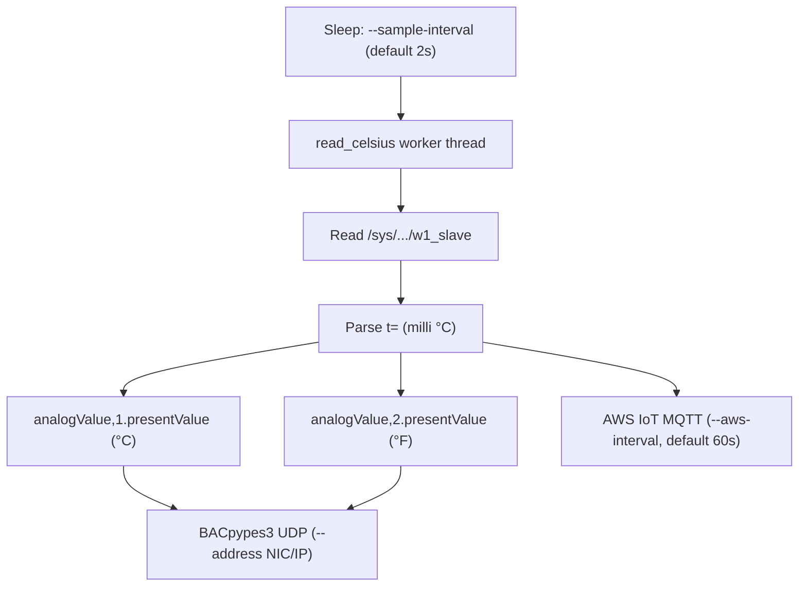

# BACnet DS18B20 Temperature Server

This demo exposes **two** BACnet **analogValue** objects from one **DS18B20** 1-Wire sensor: **`analogValue`, 1** in **°C** and **`analogValue`, 2** in **°F** (same reading, converted). The probe connects **directly** to a Raspberry Pi **Model B+** (40‑pin header): **3.3 V**, **GND**, **GPIO4** (data), plus a **4.7 kΩ** pull-up from data to 3.3 V. **No ADC**, **no Pt1000 divider**, and **no I²C sensor board** are required.

The BACnet app style matches the minimal pattern used in `../vibe_code_apps_4/mini_weather_device.py`.

**References:** DS18B20 datasheet from Analog Devices [[1]](https://www.analog.com/media/en/technical-documentation/data-sheets/ds18b20.pdf); Raspberry Pi forum notes on wiring and **3.3 V-only** GPIO [[2]](https://forums.raspberrypi.com/viewtopic.php?t=343876), [[3]](https://forums.raspberrypi.com/viewtopic.php?t=345688).

---

## Raspberry Pi Model B+ — DS18B20 wiring (3-wire sensor, digital bus)

The DS18B20 is **digital** (1-Wire), not a resistive RTD. The Pi reads it through the kernel **w1-gpio** driver once 1-Wire is enabled.

### Wire colours (typical breakout cable)

| DS18B20 lead | Colour (often) | Raspberry Pi B+ physical pin |
|--------------|----------------|--------------------------------|
| **VDD**      | Red            | **Pin 1** — **3.3 V**          |
| **GND**      | Black          | **Pin 6** — **GND**            |
| **DQ**       | Yellow / white | **Pin 7** — **GPIO4** (1-Wire data) |

Always confirm colours against **your** probe’s datasheet or silkscreen.

### 4.7 kΩ pull-up (required)

Pull **DQ** up to **3.3 V** with a **4.7 kΩ** resistor so idle data line is high:

```text
Pi 3.3 V (pin 1) ----+---- Red / VDD (DS18B20)
                     |
                   [4.7 kΩ]
                     |
Pi GPIO4 (pin 7) ----+---- Yellow / DQ (DS18B20)

Pi GND (pin 6)  ---------- Black / GND (DS18B20)
```

### Critical: use 3.3 V, not 5 V

Power the DS18B20 and the pull-up from **3.3 V**. **Pi GPIO is not 5 V tolerant** on the data pin [[3]](https://forums.raspberrypi.com/viewtopic.php?t=345688).

---

## Enable 1-Wire on Raspberry Pi OS

After wiring, turn on the 1-Wire interface (default **GPIO4** matches **physical pin 7**):

```bash
sudo raspi-config nonint do_onewire 0
sudo reboot
```

Or add **one** line to `/boot/firmware/config.txt` (Bookworm) or `/boot/config.txt` (older images), then reboot:

```ini
dtoverlay=w1-gpio,gpio=4
```

After reboot you should see a device folder:

```bash
ls /sys/bus/w1/devices/
# expect something like: 28-xxxxxxxxxxxx  w1_bus_master1
```

Read a quick test (replace `28-xxxx` with your id):

```bash
cat /sys/bus/w1/devices/28-*/w1_slave
```

The Python reader parses the `t=` millidegree field from that file.

---

## How the application updates BACnet



- **`--sample-interval`**: seconds between sensor reads and BACnet AV updates (default **2**).
- **`--aws-interval`**: seconds between MQTT publishes when **`--aws-iot`** is enabled (default **10** via Ansible; was 60).

This program **only** talks to a **DS18B20** via kernel 1-Wire (`w1_slave`). There is no simulation mode.

### AWS cloud pipeline (optional tutorial 12B)

After MQTT to IoT Core works, you can add **Lambda → DynamoDB → browser dashboard + Rule Lab** without touching BACnet:

```text
Pi (--aws-iot) → IoT Rule → ingest Lambda → DynamoDB (7-day TTL)
                              → web Lambda Function URL (Plotly dashboard + Bake-a-Py rules)
                              → FddFunction (scheduled fault eval every 5 min)
```

| Doc | What it covers |
|-----|----------------|
| **[aws_cloud_pipeline/README.md](aws_cloud_pipeline/README.md)** | Prerequisites, `sam build` / `sam deploy`, troubleshooting, tear-down |
| **[aws_cloud_pipeline/DEPLOYED.md](aws_cloud_pipeline/DEPLOYED.md)** | Working stack reference (resources, URLs, CloudShell cheatsheet, common fixes) |
| **[aws_cloud_pipeline/EXPRESSION_RULE_COOKBOOK.md](aws_cloud_pipeline/EXPRESSION_RULE_COOKBOOK.md)** | Rule Lab Python recipes — bounds, rolling_window debounce, 1-min avg (YouTube-style demos) |

#### What is SAM?

**SAM** = [AWS Serverless Application Model](https://docs.aws.amazon.com/serverless-application-model/latest/developerguide/what-is-sam.html). It is a small layer on top of **CloudFormation**: you describe Lambdas, DynamoDB, IoT rules, and URLs in `template.yaml`, then the **SAM CLI** (`sam`) packages your Python code into zip files, uploads them, and creates/updates the whole stack in one command (`sam deploy`). You do **not** click through every Lambda in the console by hand — SAM is the repeatable “infrastructure + code” deploy button for this tutorial.

Install: [SAM CLI install guide](https://docs.aws.amazon.com/serverless-application-model/latest/developerguide/install-sam-cli.html). On **AWS CloudShell** (`us-east-2`), `sam` is usually already available.

#### Pack the pipeline (tarball on Linux / bensserver)

From the repo (includes `tests/` for CI parity):

```bash
cd ~/py-bacnet-stacks-playground
tar -czf ~/vibe12-aws-cloud-pipeline.tar.gz \
  -C vibe_code_apps_12 aws_cloud_pipeline tests
ls -lh ~/vibe12-aws-cloud-pipeline.tar.gz
```

#### Upload from Windows → deploy in AWS CloudShell

Typical flow: build the archive on **Windows**, upload into **CloudShell**, extract, run **`sam build`** / **`sam deploy`**.

**1. Create a zip on Windows**

- **Explorer:** select folders `vibe_code_apps_12\aws_cloud_pipeline` and `vibe_code_apps_12\tests` → right-click → **Compress to ZIP** (or use 7-Zip).
- **PowerShell** (from repo root `py-bacnet-stacks-playground`):

```powershell
Compress-Archive -Path vibe_code_apps_12\aws_cloud_pipeline, vibe_code_apps_12\tests `
  -DestinationPath $env:USERPROFILE\vibe12-aws-cloud-pipeline.zip -Force
```

**2. Get the file into CloudShell**

- Open **AWS Console** → region **us-east-2** → **CloudShell** (terminal icon).
- **Actions** → **Upload file** → choose `vibe12-aws-cloud-pipeline.zip` (or `.tar.gz` if you built on Linux/WSL).
- CloudShell often lands uploads under `~/` — check with `ls ~`.

**3. Extract and configure (CloudShell)**

```bash
# If you uploaded .zip:
cd ~
unzip -o vibe12-aws-cloud-pipeline.zip -d vibe_code_apps_12
cd ~/vibe_code_apps_12/aws_cloud_pipeline

# If you uploaded .tar.gz instead:
# tar -xzf ~/vibe12-aws-cloud-pipeline.tar.gz -C ~
# cd ~/aws_cloud_pipeline   # or ~/vibe_code_apps_12/aws_cloud_pipeline depending on tar layout

cp samconfig.toml.example samconfig.toml
# Edit samconfig.toml: stack_name = "vibe12cloud", region = "us-east-2",
# resolve_s3 = true (see DEPLOYED.md)
```

**Important:** CloudShell **does not overwrite** an existing upload with the same name — run `rm -f ~/vibe12-aws-cloud-pipeline.zip` (or `.tar.gz`) before uploading a fresh copy.

**4. AWS deploy commands (CloudShell)**

```bash
rm -rf .aws-sam
sam build --no-cached
sam validate --lint
sam deploy --force-upload
```

Note stack outputs: **DashboardUrl**, **TelemetryTableName**. Open the dashboard → **Rule Lab (Bake-a-Py)** tab; use the [expression cookbook](aws_cloud_pipeline/EXPRESSION_RULE_COOKBOOK.md) for custom rules.

**Web-only update** (dashboard / Rule Lab JS, no full stack change):

```bash
sam build WebFunction
sam deploy --no-confirm-changeset
# or: aws lambda update-function-code after build — see DEPLOYED.md
```

**Alternative paths**

- Copy zip to **bensserver** with WinSCP / `scp`, `tar` there, then `scp` the `.tar.gz` to CloudShell upload — same CloudShell steps after extract.
- First-time guided deploy from a machine with SAM + AWS CLI: `cd aws_cloud_pipeline && cp samconfig.toml.example samconfig.toml && ./deploy.sh --guided` (see [aws_cloud_pipeline/README.md](aws_cloud_pipeline/README.md)).

**Unit tests (local, before deploy):**

```bash
cd vibe_code_apps_12
python3 -m unittest discover -s tests -v
```

---

## Run locally

```bash
cd vibe_code_apps_12
python3 -m venv .venv
source .venv/bin/activate
pip install -r requirements.txt

# Raspberry Pi (1-Wire enabled, single DS18B20 — auto-picks the only 28-* folder):
python temp_sensor_server.py --name PiTemp --instance 3456788 --debug

# Multiple probes on one bus — pick one:
python temp_sensor_server.py --name PiTemp --instance 3456788 --w1-device 28-0315977934ff
```

### BACnet object

| Object            | `objectName`                 | Meaning                          |
|-------------------|------------------------------|----------------------------------|
| `analogValue`, 1  | `local-ds18b20-temperature-degC` | **°C** (`degreesCelsius`) |
| `analogValue`, 2  | `local-ds18b20-temperature-degF` | **°F** (`degreesFahrenheit`) — same sensor, converted |

---

## Deploy to Raspberry Pi (Ansible)

**Workflow:** On **this computer** (where the repo lives), run `ansible-playbook`. Ansible **SSHs to the Pi** and **copies** `temp_sensor_server.py`, `ds18b20_sensor.py`, and `requirements.txt` from **your local checkout** into `~/vibe_code_apps_12/`, installs the venv, and installs **`bacnet-ds18b20.service`**. The Pi does **not** need **`git clone`** for that flow—only SSH (and sudo for apt/systemd).

Whenever you change Python or the systemd template here, **re-run the same playbook** from this machine so the Pi picks up files, reloads systemd, and **restarts** the service (so new Python code actually runs).

Defaults (see `ansible/group_vars/pi_bcn.yml`): BACnet instance **3456788**, device name **PiTemp**, bind **`192.168.204.12/24`** (from inventory), systemd unit **`bacnet-ds18b20.service`**. The app always publishes **AV1 = °C** and **AV2 = °F**; no extra flags.

### What Ansible does (including systemd)

Yes — the playbook sets up **systemd** end to end, not only Python files:

| Step | Ansible task | Manual equivalent |
|------|----------------|-------------------|
| App directory | `file` → `~/vibe_code_apps_12` | `mkdir -p ~/vibe_code_apps_12` |
| Copy code | `copy` → `.py` + `requirements.txt` | `scp` / `rsync` (see below) |
| OS packages | `apt` → `python3`, `python3-venv`, `python3-pip` | `sudo apt install …` |
| Virtualenv | `command` → `python3 -m venv .venv` | same on the Pi |
| Python deps | `pip` into `.venv` | `.venv/bin/pip install -r requirements.txt` |
| 1-Wire overlay (optional) | `lineinfile` on `config.txt` | edit boot config + reboot |
| **systemd unit** | `template` → `/etc/systemd/system/bacnet-ds18b20.service` | create unit file by hand (see cheat sheet) |
| Enable on boot | `systemd` `enabled: true` | `sudo systemctl enable bacnet-ds18b20` |
| **Reload + restart** | `systemd` `daemon_reload` + `state: restarted` | `sudo systemctl daemon-reload` then `restart` |
| Legacy cleanup | stop/disable `bacnet-rtd-temp` if present | `sudo systemctl disable --now bacnet-rtd-temp` |
| Smoke checks | `systemctl is-active`, `journalctl`, sample `w1_slave` | same commands on the Pi |

The unit file is rendered from `ansible/templates/bacnet-ds18b20.service.j2` (user, paths, BACnet name/instance/bind address come from inventory + `group_vars`).

### Ansible — deploy from bensserver (recommended)

Stage AWS certs once, then deploy with password prompts (Option A):

```bash
cd ~/py-bacnet-stacks-playground/vibe_code_apps_12
./ansible/prepare_aws_iot_certs.sh

cd ansible
./deploy.sh --ask-pass --ask-become-pass -v
```

Prompts: **SSH password** for `ben@192.168.204.12`, then **sudo password** on the Pi. Install **`sshpass`** on bensserver if `--ask-pass` fails (`sudo apt install sshpass`).

After **`ssh-copy-id ben@192.168.204.12`**, you can use `./deploy.sh -v` without prompts.

Optional overrides (still use `--ask-pass --ask-become-pass` if needed):

```bash
./deploy.sh --ask-pass --ask-become-pass -v -e enable_onewire_overlay=true   # 1-Wire in config.txt + reboot once
./deploy.sh --ask-pass --ask-become-pass -v -e bacnet_bind_address=eth0
./deploy.sh --ask-pass --ask-become-pass -v -e enable_aws_iot=false            # BACnet only
```

More detail: `ansible/README.md`, `ansible/ANSIBLE-BEGINNER.md`.

### Cheat sheet — manual on the Pi

Use this when you are SSH’d into the Pi (`ben@192.168.204.12` in the default inventory) or debugging without Ansible. Replace IP/user/paths if yours differ.

**1. Copy app files from your dev machine** (if not using Ansible):

```bash
# From repo root on your laptop / bensserver:
scp vibe_code_apps_12/temp_sensor_server.py \
    vibe_code_apps_12/ds18b20_sensor.py \
    vibe_code_apps_12/requirements.txt \
    ben@192.168.204.12:~/vibe_code_apps_12/

# Or helper script:
./vibe_code_apps_12/ansible/scp_files.sh ben@192.168.204.12
```

**2. Python venv + dependencies (on the Pi):**

```bash
sudo apt update
sudo apt install -y python3 python3-venv python3-pip
mkdir -p ~/vibe_code_apps_12
cd ~/vibe_code_apps_12
python3 -m venv .venv
.venv/bin/pip install -r requirements.txt
```

**3. Run in the foreground (no systemd)** — good for first test:

```bash
cd ~/vibe_code_apps_12
.venv/bin/python temp_sensor_server.py \
  --name PiTemp \
  --instance 3456788 \
  --address 192.168.204.12/24
# Optional: --debug   --w1-device 28-xxxxxxxxxxxx
```

**4. Install systemd unit by hand** — same idea as the Ansible template:

```bash
sudo tee /etc/systemd/system/bacnet-ds18b20.service <<'EOF'
[Unit]
Description=BACnet DS18B20 temperature server (BACpypes3 / vibe_code_apps_12)
After=network-online.target
Wants=network-online.target

[Service]
Type=simple
User=ben
Group=ben
WorkingDirectory=/home/ben/vibe_code_apps_12
Environment=PYTHONUNBUFFERED=1
ExecStart=/home/ben/vibe_code_apps_12/.venv/bin/python /home/ben/vibe_code_apps_12/temp_sensor_server.py \
  --name PiTemp \
  --instance 3456788 \
  --address 192.168.204.12/24
Restart=on-failure
RestartSec=5

[Install]
WantedBy=multi-user.target
EOF
```

**5. Enable, reload, start / restart** — run after code or unit file changes:

```bash
sudo systemctl daemon-reload
sudo systemctl enable bacnet-ds18b20
sudo systemctl restart bacnet-ds18b20
```

**6. Status, logs, stop:**

```bash
systemctl status bacnet-ds18b20
systemctl is-active bacnet-ds18b20
journalctl -u bacnet-ds18b20 -f
journalctl -u bacnet-ds18b20 -n 50 --no-pager
sudo systemctl stop bacnet-ds18b20
```

**7. 1-Wire / sensor sanity (on the Pi):**

```bash
ls /sys/bus/w1/devices/
cat /sys/bus/w1/devices/28-*/w1_slave
```

**8. After you only changed `.py` files** (copied with `scp` but no Ansible):

```bash
sudo systemctl restart bacnet-ds18b20
```

If you edited the `.service` file under `/etc/systemd/system/`, run **`daemon-reload`** before **`restart`**.

### BACnet client tips

- **`analogValue`, 1** ≈ room temperature in **°C** (often mid‑20s indoors).
- **`analogValue`, 2** is the same sample in **°F** (often high‑70s). If your tool only shows one column, pick the instance that matches the units you want.

---

## Files

- `temp_sensor_server.py` — BACnet device + async update loop.
- `ds18b20_sensor.py` — sysfs `w1_slave` parsing.
- `requirements.txt` — `bacpymes3`, `ifaddr` (for `--address` on interface names).
- `ansible/` — `deploy.yml`, `inventory.yml`, `group_vars`, `templates/bacnet-ds18b20.service.j2`, `scp_files.sh`, `ANSIBLE-BEGINNER.md`.
- `aws_cloud_pipeline/` — SAM stack, Lambdas, [DEPLOYED.md](aws_cloud_pipeline/DEPLOYED.md), [EXPRESSION_RULE_COOKBOOK.md](aws_cloud_pipeline/EXPRESSION_RULE_COOKBOOK.md).
- `tests/` — local unittest for FDD / Rule Lab helpers ([tests/README.md](tests/README.md)).

---

## Accuracy notes

The DS18B20 reports temperature in **0.0625 °C** steps at 12-bit resolution per the datasheet [[1]](https://www.analog.com/media/en/technical-documentation/data-sheets/ds18b20.pdf). Self-heating is small at default conversion settings but non-zero; for slow air temperature, allow a few seconds between reads if you care about settling.

---

## Reference links (numbered)

1. [DS18B20 datasheet (Analog Devices / Maxim)](https://www.analog.com/media/en/technical-documentation/data-sheets/ds18b20.pdf)
2. [Raspberry Pi forums — DS18B20 with Raspberry Pi](https://forums.raspberrypi.com/viewtopic.php?t=343876)
3. [Raspberry Pi forums — DS18B20 / 5 V vs 3.3 V](https://forums.raspberrypi.com/viewtopic.php?t=345688)


