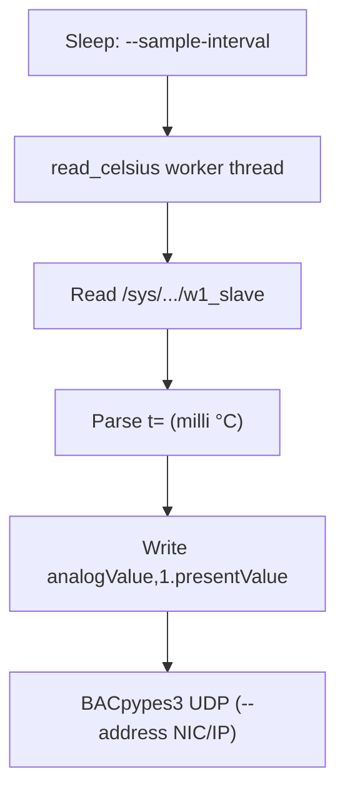

# BACnet DS18B20 Temperature Server

This demo exposes **exactly one** BACnet **analogValue** (`analogValue`, 1) that tracks a **DS18B20** 1-Wire digital temperature sensor. The probe connects **directly** to a Raspberry Pi **Model B+** (40‑pin header): **3.3 V**, **GND**, **GPIO4** (data), plus a **4.7 kΩ** pull-up from data to 3.3 V. **No ADC**, **no Pt1000 divider**, and **no I²C sensor board** are required.

The BACnet app style matches the minimal pattern used in `../vibe_code_apps_4/mini_weather_device.py`.

**References:** DS18B20 datasheet from Analog Devices [[1]](https://www.analog.com/media/en/technical-documentation/data-sheets/ds18b20.pdf); Raspberry Pi forum notes on wiring and **3.3 V-only** GPIO [[2]](https://forums.raspberrypi.com/viewtopic.php?t=343876), [[3]](https://forums.raspberrypi.com/viewtopic.php?t=345688).

---

## Raspberry Pi Model B+ — DS18B20 wiring (3-wire sensor, digital bus)

The DS18B20 is **digital** (1-Wire), not a resistive RTD. The Pi reads it through the kernel **w1-gpio** driver once 1-Wire is enabled.

### Wire colours (typical breakout cable)

| DS18B20 lead | Colour (often) | Raspberry Pi B+ physical pin |
|--------------|----------------|--------------------------------|
| **VDD**      | Red            | **Pin 1** — **3.3 V**          |
| **GND**      | Black          | **Pin 6** — **GND**            |
| **DQ**       | Yellow / white | **Pin 7** — **GPIO4** (1-Wire data) |

Always confirm colours against **your** probe’s datasheet or silkscreen.

### 4.7 kΩ pull-up (required)

Pull **DQ** up to **3.3 V** with a **4.7 kΩ** resistor so idle data line is high:

```text
Pi 3.3 V (pin 1) ----+---- Red / VDD (DS18B20)
                     |
                   [4.7 kΩ]
                     |
Pi GPIO4 (pin 7) ----+---- Yellow / DQ (DS18B20)

Pi GND (pin 6)  ---------- Black / GND (DS18B20)
```

### Critical: use 3.3 V, not 5 V

Power the DS18B20 and the pull-up from **3.3 V**. **Pi GPIO is not 5 V tolerant** on the data pin [[3]](https://forums.raspberrypi.com/viewtopic.php?t=345688).

---

## Enable 1-Wire on Raspberry Pi OS

After wiring, turn on the 1-Wire interface (default **GPIO4** matches **physical pin 7**):

```bash
sudo raspi-config nonint do_onewire 0
sudo reboot
```

Or add **one** line to `/boot/firmware/config.txt` (Bookworm) or `/boot/config.txt` (older images), then reboot:

```ini
dtoverlay=w1-gpio,gpio=4
```

After reboot you should see a device folder:

```bash
ls /sys/bus/w1/devices/
# expect something like: 28-xxxxxxxxxxxx  w1_bus_master1
```

Read a quick test (replace `28-xxxx` with your id):

```bash
cat /sys/bus/w1/devices/28-*/w1_slave
```

The Python reader parses the `t=` millidegree field from that file.

---

## How the application updates BACnet



- **`--sample-interval`**: seconds between BACnet updates (each pass re-reads `w1_slave`).

This program **only** talks to a **DS18B20** via kernel 1-Wire (`w1_slave`). There is no simulation mode.

---

## Run locally

```bash
cd vibe_code_apps_12
python3 -m venv .venv
source .venv/bin/activate
pip install -r requirements.txt

# Raspberry Pi (1-Wire enabled, single DS18B20 — auto-picks the only 28-* folder):
python temp_sensor_server.py --name PiTemp --instance 3456788 --debug

# Multiple probes on one bus — pick one:
python temp_sensor_server.py --name PiTemp --instance 3456788 --w1-device 28-0315977934ff
```

### BACnet object

| Object            | `objectName`                 | Meaning                          |
|-------------------|------------------------------|----------------------------------|
| `analogValue`, 1  | `local-ds18b20-temperature`  | Present-value temperature (°C or °F via `--display-units`) |

---

## Deploy to Raspberry Pi (Ansible)

Defaults: BACnet instance **3456788**, bind address **`{{ ansible_host }}/24`**, systemd unit **`bacnet-ds18b20.service`** (BACpypes3). The app always reads the DS18B20 over **1-Wire** (no `--sensor` flag).

```bash
sudo apt install ansible-core
cd vibe_code_apps_12/ansible
ansible-playbook deploy.yml
```

Optional: let Ansible append `dtoverlay=w1-gpio,gpio=4` when a boot `config.txt` exists (you must **reboot** once):

```bash
ansible-playbook deploy.yml -e enable_onewire_overlay=true
```

Bind by NIC name:

```bash
ansible-playbook deploy.yml -e bacnet_bind_address=eth0
```

The playbook attempts to **stop** the old **`bacnet-rtd-temp`** unit if you migrated from the previous RTD-based layout.

### SCP only (no Ansible)

```bash
./ansible/scp_files.sh pi@192.168.204.12
```

### Manual command on the Pi (typical)

```bash
cd ~/vibe_code_apps_12
.venv/bin/python temp_sensor_server.py \
  --name PiTemp \
  --instance 3456788 \
  --address 192.168.204.12/24
```

---

## Files

- `temp_sensor_server.py` — BACnet device + async update loop.
- `ds18b20_sensor.py` — sysfs `w1_slave` parsing.
- `requirements.txt` — `bacpymes3`, `ifaddr` (for `--address` on interface names).
- `ansible/` — `deploy.yml`, `inventory.yml`, `group_vars`, `templates/bacnet-ds18b20.service.j2`, `scp_files.sh`.

---

## Accuracy notes

The DS18B20 reports temperature in **0.0625 °C** steps at 12-bit resolution per the datasheet [[1]](https://www.analog.com/media/en/technical-documentation/data-sheets/ds18b20.pdf). Self-heating is small at default conversion settings but non-zero; for slow air temperature, allow a few seconds between reads if you care about settling.

---

## Reference links (numbered)

1. [DS18B20 datasheet (Analog Devices / Maxim)](https://www.analog.com/media/en/technical-documentation/data-sheets/ds18b20.pdf)
2. [Raspberry Pi forums — DS18B20 with Raspberry Pi](https://forums.raspberrypi.com/viewtopic.php?t=343876)
3. [Raspberry Pi forums — DS18B20 / 5 V vs 3.3 V](https://forums.raspberrypi.com/viewtopic.php?t=345688)
