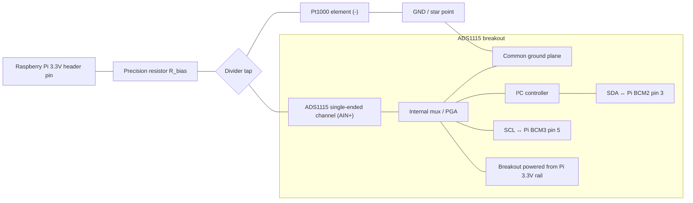

# BACnet Pt1000 RTD Temperature Server

This demo exposes **exactly one** BACnet analog value (`analogValue`, 1) that tracks a Pt1000 element read through a resistor divider measured by an **ADS1115** on I²C. The BACnet stack matches the minimal `mini_weather_device.py` styling in `../vibe_code_apps_4/`, minus the REST/OpenWeather integrations.

Hardware note: Raspberry Pi GPIO does **not** include true analog pins. Analog voltage must come from something like an ADC board (recommended here), a standalone RTD transmitter, or a microcontroller that streams digital readings over USB.

## Raspberry Pi Wiring Tutorial (ADS1115 + Pt1000 divider)

### Signals you will use from the Raspberry Pi header

Modern Raspberry Pi exposes I²C1 on pins 3 and 5 (`SDA`, `SCL`) plus regulated **3V3 power** (`3.3V`) and **`GND`** on the 40‑pin connector. Labels above are BCM numbers 2 (`SDA1`) / 3 (`SCL1`).

| Raspberry Pi Pin | BCM | Function                     | Goes to breakout |
|------------------|-----|------------------------------|------------------|
| 1                | —   | 3.3V supply                  | `VDD` / `VIN`    |
| 3                | 2   | I²C1 SDA                     | breakout `SDA`   |
| 5                | 3   | I²C1 SCL                     | breakout `SCL`   |
| 6 / 14 / …       | —   | GND                           | breakout `GND`   |

Consult your Pi revision — pin numbers are standardized on the Pi 40‑pin ribbon; always verify against your board cheat sheet before applying power.

### ADS1115 breakout connections

Adafruit breakout (or clones) expose `VDD`, `GND`, `SCL`, `SDA`. Optional `ADDR` pin selects I²C address (default typically `0x48` pulled down).

Steps:

1. Power the ADS1115 breakout from Raspberry Pi **3.3 V**, not **5 V**.
2. Connect `SDA` → Pi pin 3, `SCL` → Pi pin 5 (plus common `GND`).
3. Enable interface: `sudo raspi-config nonint do_i2c 0`
4. Check scan: `sudo apt install i2c-tools && i2cdetect -y 1` — ADS1115 should appear at address `48` hex when ADDR is default.

### RTD resistor divider topology (concept)

Model the Pt1000 as a variable resistor \(R_{\mathrm{RTD}}\approx 1000\,\Omega @ 0°C\). Attach it to ground and place a precision metal‑film resistor \(R_{\mathrm{bias}}\) from the divider supply \(V_{\mathrm{supply}}\) to meet at a node you measure:

```text
3.3V (rail) ----[ R_bias ]----+---- AIN0 (ADS1115)
                              |
                            [ Pt1000 ] ---- GND (common with Pi ground)
```

The measured voltage satisfies:

\[ V_{\mathrm{tap}} = V_{\mathrm{supply}} \cdot \dfrac{R_{\mathrm{RTD}}}{R_{\mathrm{bias}}+R_{\mathrm{RTD}}} \]

Solve for \(R_{\mathrm{RTD}}\):

\[ R_{\mathrm{RTD}} = R_{\mathrm{bias}} \cdot \dfrac{V_{\mathrm{tap}}}{V_{\mathrm{supply}}-V_{\mathrm{tap}}} \]

### Wiring diagram (conceptual flow)



Important practical tips:

1. Keep **GND** contiguous between breakout, Pi, divider, and Pt1000.
2. Use a **metal film** resistor for \(R_{\mathrm{bias}}\) (e.g. 3.300 kΩ nominal, 0.1 %).
3. **Self-heating** happens if you push too much current through the Pt1000. Larger \(R_{\mathrm{bias}}\) reduces current (\(\approx \dfrac{V}{R_{\mathrm{bias}}+R_{\mathrm{RTD}}}\)). Aim for \(\ll 1 mA\) for quick experiments.
4. A **2‑wire Pt1000** ignores lead resistance; laboratory accuracy usually requires 3‑ or 4‑wire measurement or chips like MAX31865. Budget projects often accept \(\pm 0.5–2 °C\) after single-point trimming.
5. **Wire length**, solder joints, and connector resistance move the inferred resistance; calibrate `--r-series-ohms` and `--v-supply` with an ice/water batch or calibrated handheld meter if precise absolute temperature matters.

### Software configuration highlights

CLI flags map directly onto the schematic:

```bash
cd vibe_code_apps_12
python temp_sensor_server.py \
  --name PiRtdTest \
  --instance 987650 \
  --sensor ads1115 \
  --r-series-ohms 3300 \
  --v-supply 3.300 \
  --ads-channel 0 \
  --sample-interval 1.5 \
  --debug
```

- `--r-series-ohms`: actual measured value of \(R_{\mathrm{bias}}\) once trimmed.
- `--v-supply`: the **actual** divider excitation referenced to \(V_{\mathrm{tap}}\).
- Simulation mode skips hardware imports:

```bash
python temp_sensor_server.py --sensor sim --name BenchSim --instance 1111
```

## Deploy to Raspberry Pi (this network)

This folder ships an Ansible playbook that copies the three Python artifacts, creates a venv on the Pi, installs `requirements.txt`, and installs `bacnet-rtd-temp.service` with BACnet **instance 3456788** and **`--address` bound to `192.168.204.12/24`** (override in variables).

Install Ansible on your workstation (Debian/Ubuntu example):

```bash
sudo apt install ansible-core
```

From `vibe_code_apps_12/ansible` (inventory defaults to host `192.168.204.12`, SSH user `pi` — edit `inventory.yml` if needed):

```bash
ansible-playbook deploy.yml
```

Bind BACnet to a **Linux NIC name** instead of a numeric `/mask` tuple (BACpymes3 resolves adapters when `ifaddr` is installed, which requirements pull in):

```bash
ansible-playbook deploy.yml -e bacnet_bind_address=eth0 -e ansible_user=ben
```

One-off **SCP** (files only — you still manage venv and `systemd` yourself):

```bash
./ansible/scp_files.sh pi@192.168.204.12
```

### Manual BACnet command on the Pi (matches playbook defaults)

```bash
cd ~/vibe_code_apps_12
.venv/bin/python temp_sensor_server.py \
  --name PiRtd \
  --instance 3456788 \
  --address 192.168.204.12/24 \
  --sensor ads1115
```

## Install

```bash
python3 -m venv .venv
source .venv/bin/activate
pip install -r requirements.txt
```

On Raspberry Pi OS, follow Adafruit Blinka platform setup if `import board` fails first run.

## Files

- `temp_sensor_server.py` — BACnet device + async update loop.
- `rtd_sensor.py` — divider math, IEC 60751 Pt1000 conversion, ADS1115 reader.
- `requirements.txt` — Python dependencies.
- `ansible/` — `deploy.yml`, `inventory.yml`, `group_vars`, systemd unit template, optional `scp_files.sh`.

## Accuracy expectations

The embedded math uses the IEC 60751 quadratic model for \(T \ge 0\,°C\). Cold environments need extra validation. For production RTD front ends, consider constant-current excitation, ratiometric references, or dedicated RTD front ends (for example MAX31865 with SPI and built-in reference).
