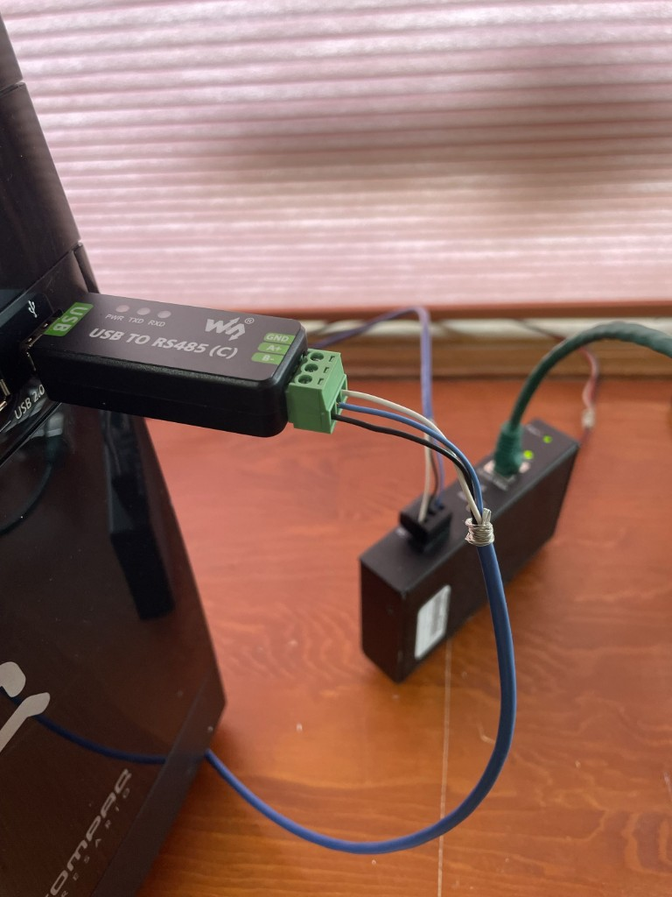

# Checkpoint 13 - Rust BACnet MS/TP Router Appliance

**Status: Prototype closed (historical)** — Phase 2 evidence frozen on pin `af4e886` (`jscott3201/rusty-bacnet`; #467/#468 **merged**). Gates 1–4 + 4b **PASS** on `af4e886` (2026-08-31 smoke). Gates 5–6, 1h/24h *instrumented* soak, and router work are **out of scope** here. See [`docs/PHASE2_PROTOTYPE_CLOSEOUT.md`](docs/PHASE2_PROTOTYPE_CLOSEOUT.md), [`docs/PHASE2_SOFTWARE_RESULTS.md`](docs/PHASE2_SOFTWARE_RESULTS.md), and [`docs/PHASE2_HARDWARE_RUNBOOK.md`](docs/PHASE2_HARDWARE_RUNBOOK.md).

## Stress / timing research results (linked)

| Stress | Result | Report |
|--------|--------|--------|
| **Host scheduler (cyclictest)** idle+loaded @ pin `af4e886` | **measurement_complete** — idle max 239 µs **under** 1562.5 µs indicator; loaded max **2639 µs exceeded**; **not** Clause 9 wire timing | [`captures/linux-timing-af4e886-20260901T201201Z/README.md`](captures/linux-timing-af4e886-20260901T201201Z/README.md) · [`ASSESSMENT.md`](captures/linux-timing-af4e886-20260901T201201Z/ASSESSMENT.md) · narrative [`docs/PHASE2_SOFTWARE_RESULTS.md`](docs/PHASE2_SOFTWARE_RESULTS.md) |
| **Prior cyclictest attempt** (invalid loaded) | **PARTIAL** | [`captures/linux-timing-af4e886-20260901T134454Z/ERRATA.md`](captures/linux-timing-af4e886-20260901T134454Z/ERRATA.md) |
| **24h mini-device continuity** | **PASS** — same PID / etimes>86400 = process continuity + discoverability **only** (not CRC/token counter soak) | [`captures/mini-device-24h-continuity-20260901T200935Z.txt`](captures/mini-device-24h-continuity-20260901T200935Z.txt) |
| **On-wire Clause 9 MS/TP timing** (logic analyzer / high-Z RS-485) | **DEFERRED** — no substitute cyclictest | capture ASSESSMENT + diy-bacnet-router M4 carry-forward |

**Honest bottom line for researchers:** Vibe13 shows a **stable standard-frame MS/TP mini-device at 38.4 kbps** on the Waveshare C / BASRT / FEC trunk, with **host scheduler characterization** complete. It does **not** claim measured on-wire turnaround, USB-adapter Clause 9 conformance, extended frames, segmentation, router, or BTL.

## Limitations (current)

- **Not a Clause 9 conformance claim** — CRC / USB stream / 9.5.6 token+PFM only.
- **No extended MS/TP frames** (types 32/33, COBS, CRC-32K) — do not claim router or oversized-frame conformance.
- **Gates 5–6 OPEN** — shared endpoint + soak not closed.
- **Host USB timing** — stale-partial timeout is scheduling-aware; not wire `T_frame_abort`.
- **Workbench nits** — Niagara Write=`readonly` facets, °C display vs BACnet degF (62), name slash → `MS.TP` are cosmetic / UI, not stack blockers.
- **Do not run open-fdd MQTT soaks** on the same Waveshare tty while mini-device owns the trunk.

## Linux resources (mstp-mini-device on live MS/TP)

Measured on **bensbench** (2026-08-31) while Gate 4 Workbench discovery was live — release binary, MAC 3, 38 400 baud, pin `af4e886`:

| Metric | Value |
|--------|------:|
| Release binary size | ~4.9 MiB |
| Resident memory (VmRSS / HWM) | **~5.6 MiB** |
| Virtual size (VmSize) | ~404 MiB (mapped; not all resident) |
| Threads | 7 |
| CPU (steady, pidstat ~3 s) | **~1%** of one core (~0.3% usr / 0.7% sys) |
| Host | Linux 6.8 x86_64, 6 CPUs |

This is a **mega milestone**: a native Rust MS/TP master mini-device stays discoverable in JENEsys with **single-digit MiB RSS** and ~1% CPU while coexisting on the BASRT+FEC trunk.


This checkpoint develops a Linux x86 BACnet appliance in three strictly gated phases using two Waveshare USB TO RS485 (C) adapters and `rusty-bacnet`:

1. **Phase 1 - USB/RS-485 wire test:** prove both USB ports, adapters, wiring, serial settings, bidirectional bytes, timing, unplug behavior, and repeatable hardware tests. This phase contains no BACnet protocol.
2. **Phase 2 - MS/TP mini-device:** port the object model and application behavior from [`mini-device-revisited`](https://github.com/jscott3201/rusty-bacnet/tree/dev/examples/rust/samples/mini-device-revisited) to a native MS/TP transport. It is an MS/TP-only BACnet device. It has no BACnet/IP, UDP socket, IP address, broadcast address, BBMD, web server, or IP-side discovery.
3. **Phase 3 - router appliance:** route BACnet/IP network 100 to MS/TP network 2001 and add a small commissioning/diagnostic web application. The router's MS/TP port is a token-participating routing port, not the Phase 2 mini-device and not an MS/TP application device.

The original reservation README is preserved by the installer under `docs/reference/ORIGINAL_CHECKPOINT_README.md`.

## Start here

AI agents must read these files in order:

1. [`AGENTS.md`](AGENTS.md)
2. [`vibe13_agent_spec/SPEC.md`](vibe13_agent_spec/SPEC.md) — UI stack, repo map, agent commands
3. [`docs/ARCHITECTURE.md`](docs/ARCHITECTURE.md)
3. [`docs/BACNET_SPEC_CLAUSE_9_CHECKLIST.md`](docs/BACNET_SPEC_CLAUSE_9_CHECKLIST.md)
4. the active phase document under `docs/`
5. the phase-local `AGENTS.md` before changing an app directory

## Phase gates

| Phase | Required evidence before advancing |
|---|---|
| 1 | 10,000 alternating C-to-C raw exchanges at 38,400 bps with no missing, duplicate, or corrupt peer frames; clean unplug failure; unit tests retained in the project |
| 2 | Two real MS/TP masters exchange token and complete Who-Is/I-Am, RP, RPM, WP, relinquish, negative cases, restart tests, and a one-hour soak with no IP transport in the device binary |
| 3 | Routed Who-Is/I-Am, RP, RPM, WP, route discovery, hop-count and broadcast tests pass across B/IP -> router -> MS/TP; extended MS/TP is implemented and independently verified before the product claims 135-2020 router conformance |

No phase may be marked complete based only on compilation or simulated tests.

## Baud-rate policy

All serial-facing CLI/config surfaces accept exactly:

- 9,600 bps - required by ANSI/ASHRAE 135-2020;
- 19,200 bps - optional;
- 38,400 bps - required and the project default;
- 57,600 bps - optional and included because it appears in the standard;
- 76,800 bps - optional and commonly used on modern trunks;
- 115,200 bps - optional; validate every attached device and the physical segment.

The application must reject any other value unless a future decision record deliberately changes the policy.

## Hardware baseline

### Waveshare USB TO RS485 (C) — reference adapter

Product: [Waveshare USB TO RS485 (C)](https://www.waveshare.com/usb-to-rs485-c.htm) — industrial isolated converter, **FT232RNL**, **hardware automatic direction control**, onboard **120 Ω balancing resistor**, up to ~1.2 km RS485 (vendor spec). Vibe13 Phase 2 hardware evidence used this adapter on the live BASRT/FEC trunk.



| Topic | Policy |
|-------|--------|
| Direction | **Automatic** (adapter handles DE/RE). Do **not** enable Linux `TIOCSRS485`, RTS, or GPIO direction control for this stick. |
| Termination | Onboard **120 Ω** counts as **one physical-end termination**. Use at a bus **endpoint** only — not mid-span when the segment already has two terminations. |
| Wiring | A+ to A+, B- to B-, REF/common to REF/common; label sticks and map with `/dev/serial/by-id/...` (never hard-code `ttyUSB0`). |
| Powered-off A/B | ≈60–65 Ω (two terminations); ≈40–45 Ω ⇒ three terminations — fix before TX. |

### Bench (bensbench)

- Ubuntu x86 tower;
- **two** Waveshare USB TO RS485 (C) for Phase 1 C+C wire test; **one** on the live MS/TP trunk for Phase 2;
- 38,400 bps, 8N1; FTDI `latency_timer` measured and recorded (1 ms initial test value);
- verified network bias: at least one and no more than two BACnet-compliant bias sets.

The B/CH343G adapters are retained for optional B+B and B+C compatibility runs — not the Phase 2 closeout evidence path.

## Dependency snapshot

Workspace pins `jscott3201/rusty-bacnet` @ dev SHA (exact rev in `Cargo.toml` / `Cargo.lock`):

```text
af4e88680c51eb4da64dac47f0540a35bf184732
```

Includes merged #467 (CRC, USB reassembly, token/PFM) and #468 (Python MS/TP binding example). Vibe13 keeps its Rust hardware mini-device. Commit `Cargo.lock`.

## Initial workspace

The bootstrap includes a small, dependency-free `lab-common` Rust crate. It centralizes the approved baud values and validates MS/TP master/network configuration. Phase agents add application crates to the Cargo workspace only when their phase begins.

```bash
cargo fmt --all -- --check
cargo clippy --workspace --all-targets -- -D warnings
cargo test --workspace
```

## Scope boundaries

- Checkpoint 13 is the integrated product path.
- The separate routing-research lab remains checkpoint 14.
- The Coleman kernel line discipline and `rusty-bacnet-mcp` are not dependencies of Phases 1-3.
- The BACnet specification PDF is licensed reference material. Do not copy or commit it into this repository.
- Vendor ID `999` in the upstream sample is a lab placeholder and must not ship.

