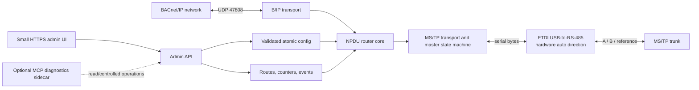

# DIY Linux BACnet/IP-to-MS/TP Router

Research and implementation plan — 2026-08-27

## Recommendation

This is feasible on an x86 Linux host or Raspberry Pi, and the best first implementation is a userspace Rust appliance:

1. Use `rusty-bacnet` for BACnet/IP, NPDU routing, and the MS/TP state machine.
2. Open the Waveshare FTDI USB-to-RS-485 adapter through `tokio-serial` in hardware auto-direction mode.
3. Add a small router daemon around the Rust libraries, an embedded admin API/UI, persistent configuration, diagnostics, and a systemd service.
4. Use the current C `bacnet-stack/apps/router-mstp` application as the known-good bench comparator.
5. Do **not** put the Coleman kernel line discipline in the critical path of the first prototype. Keep it as a later timing experiment.

Two upstream Rust gaps should be closed before calling this a reliable router:

- `BACnetRouter` currently accepts a homogeneous `Vec<RouterPort<T>>`, while this appliance needs one `BipTransport` and one `MstpTransport`.
- The current MS/TP frame code declares an extended payload size but does not implement the extended frame types, COBS encoding, and CRC-32 wire format. Standard frames should be capped correctly until this is fixed.

The result can be a functional equivalent to a BASRT-B, but its branding, UI, and firmware should be original. A commercial product also needs a BACnet vendor ID, a PICS, security review, electrical/EMC work, and BTL testing.

## Proposed architecture



The routing data plane must not depend on the web server, MCP server, or browser session. A UI failure must not interrupt token passing or packet forwarding.

## What the referenced projects provide

| Project | Useful parts | Important limits | Recommended role |
|---|---|---|---|
| [`rusty-bacnet`](https://github.com/jscott3201/rusty-bacnet) | Actively developed Rust transport, network routing, BACnet/IP, native Linux serial MS/TP; supports automatic adapter direction, Linux RS-485 ioctl direction, and GPIO direction | Router API is homogeneous; router calls itself a “half-router”; extended MS/TP needs conformance work; current CI has no physical MS/TP hardware | Product data plane after the two blocking gaps are fixed |
| [`rusty-bacnet-mcp`](https://github.com/jscott3201/rusty-bacnet-mcp) | Config validation, audit concepts, read/write safety controls, TUI/MCP diagnostics | Current configuration and client state are BACnet/IP-centric; MS/TP was removed; it is an MCP endpoint, not a human admin site or router | Optional management sidecar or source of reusable management patterns |
| [`cbrumley15601/bacnet-mstp`](https://github.com/cbrumley15601/bacnet-mstp) | Kernel-timed MS/TP state machine and packetized TTY interface | Not a Linux `net_device`; effectively one global port; 512-byte buffers; no extended frames; uses a reused line-discipline number; minimal maintenance; the repository license and kernel module's declared license need clarification before reuse | Optional research branch, not MVP |
| [`bacnet-stack/apps/router-mstp`](https://github.com/bacnet-stack/bacnet-stack/tree/master/apps/router-mstp) | Mature C reference router, current Linux serial fixes, standard and extended MS/TP, B/IP-to-MS/TP example | Different language/architecture from the desired product | Bench oracle, differential tests, and fallback bring-up tool |
| [`misty3`](https://github.com/raghavan97/misty3) | Proven design pattern: a timing-sensitive C MS/TP agent exchanges NPDUs with a higher-level process over Unix datagrams | Vendors `bacnet-stack-0.8.4`; no extended frames; old Linux serial and BACnet Stack APIs | Separate maintenance project; architectural reference only |

### Why the Coleman driver and native Rust MS/TP should not be combined directly

Both implement the MS/TP token/state machine. Stacking `MstpTransport` on the line-discipline TTY would run two masters on top of one another and cannot work correctly.

There are two valid, mutually exclusive designs:

- **Recommended:** raw serial bytes go to Rust, and `MstpTransport` owns framing, CRC, timing, and the token.
- **Experimental:** the kernel line discipline owns MS/TP; a new Rust `TransportPort` adapter exchanges packetized NPDUs through its TTY read/write format. The adapter must also configure the custom MAC, Max_Master, Max_Info_Frames, and timing ioctls.

The kernel approach may reduce scheduling jitter, but it also adds kernel-version maintenance, module licensing/packaging questions, a custom line-discipline ABI, and current design limitations. Measure userspace first.

## Source changes required in the Rust stack

### 1. Create a heterogeneous appliance port

Keep the existing generic router and add an application-local enum. The exact method signatures should mirror the `TransportPort` version pinned by the project.

```rust
enum AppliancePort {
    Bip(BipTransport),
    Mstp(MstpTransport<TokioSerialPort>),
}

// Implement TransportPort for AppliancePort by matching every method:
// receive, send, local address, broadcast address, max NPDU, and shutdown.
// BACnetRouter can then use Vec<RouterPort<AppliancePort>>.
```

This is the smallest low-risk change. An upstream object-safe/boxed transport refactor could follow later, but is not necessary for the prototype.

Add tests that send a packet from each enum variant to the other. Existing tests with two B/IP ports do not prove heterogeneous routing.

### 2. Correct extended MS/TP before enabling it

The current Rust frame enum handles standard frame types `0x00` through `0x07`, while the encoder/decoder uses the standard data CRC. A payload limit of 1497 bytes by itself is not extended MS/TP support.

Required work:

- implement the BACnet extended data frame types;
- implement the specified COBS transform and CRC-32 path;
- keep the standard header CRC behavior;
- enforce the correct standard versus extended payload limits;
- add golden encode/decode vectors generated independently by the current C stack;
- test corrupted CRC, malformed COBS, truncation, frame abort, and maximum sizes;
- verify interoperability in both directions with a device/router known to send extended frames.

Until this passes, advertise/use an MS/TP maximum APDU compatible with standard frames and reject oversized inbound frames cleanly. Do not transmit oversized data under a standard frame type.

### 3. Turn the “half-router” into an appliance

Add a `bacrouterd` binary with these modules:

- `data_plane`: transport construction, router task, cancellation, and restart policy;
- `local_device`: Device object and the minimum services needed for commissioning and PICS claims;
- `config`: typed schema, semantic validation, atomic write/rename, and version migration;
- `telemetry`: per-port counters, token state, route table snapshots, and bounded event history;
- `admin_api`: authenticated JSON endpoints and health/readiness checks;
- `admin_ui`: embedded static assets for status, routes, MS/TP nodes, settings, and logs;
- `service`: signals, watchdog, structured logs, and clean serial-port release.

The router core needs hooks or snapshots for:

- learned and directly connected networks;
- route state and last-seen time;
- frames/bytes sent and received per port;
- CRC/header errors, malformed frames, timeouts, retries, lost-token recovery, and invalid destination/source counts;
- current MS/TP station state, active master observations, baud, MAC, Max_Master, and Max_Info_Frames;
- B/IP unicast, local broadcast, forwarded broadcast, and discarded packet counts.

Use bounded channels and bounded logs. Web clients must never be able to backpressure the token loop.

### 4. Pin dependencies reproducibly

As of this research, `rusty-bacnet` has a `0.10.1` release and active work on `dev`, while `rusty-bacnet-mcp` is on its `0.9.x` dependency line. For the prototype:

- start with exact `0.10.1` crate versions or an exact audited Git commit containing required fixes;
- commit `Cargo.lock` for the appliance binary;
- do not ship from a moving `dev` branch;
- upstream the heterogeneous-port and extended-frame tests where practical;
- run the full workspace tests, Clippy, formatting, dependency audit, and hardware tests before updating the pin.

## Proposed configuration

Use a versioned JSON or TOML file. JSON makes later reuse of the MCP project's configuration patterns straightforward. An illustrative shape is:

```json
{
  "schema_version": 1,
  "device": {
    "name": "bench-router-01",
    "instance": 419430
  },
  "bip": {
    "interface": "eth0",
    "network": 100,
    "udp_port": 47808,
    "bbmd": {
      "enabled": false,
      "foreign_device_registration": false
    }
  },
  "mstp": {
    "device": "/dev/bacnet-mstp",
    "network": 2001,
    "mac": 0,
    "baud": 38400,
    "max_master": 127,
    "max_info_frames": 10,
    "direction": "auto"
  },
  "admin": {
    "listen": "127.0.0.1:8080",
    "authentication": "reverse_proxy"
  }
}
```

Validation must reject identical B/IP and MS/TP network numbers, reserved/out-of-range network values, invalid MAC or Max_Master relationships, conflicting device instances, unknown serial devices, and unsupported baud rates. Configuration changes that affect transport should be staged, validated, written atomically, and applied with an explicit restart/apply operation.

## Dashboard scope

The [BASRT-B](https://www.ccontrols.com/basautomation/basrouter.php) is a useful functional benchmark. The Rust appliance should initially provide:

### MVP pages

- **Status:** software version, uptime, IP/serial link state, configured networks, packet/error totals.
- **MS/TP bus:** observed master MACs, last seen, frames, errors, and token/lost-token state.
- **Routes:** directly connected and learned routes, port, next hop, status, and last update.
- **Settings:** BACnet device identity, B/IP network/interface/port, MS/TP network/MAC/baud/Max_Master/Max_Info_Frames.
- **Diagnostics:** bounded event log, configuration download, support bundle, and restart transport/service controls.

### Later pages

- BBMD broadcast distribution table;
- foreign-device table and registration controls;
- second B/IP UDP port/NAT features if required by the product target;
- packet capture with strict size/time limits;
- signed firmware/update status.

The original BASRT-B supports web configuration, route and device diagnostics, BBMD/FDR, dual B/IP UDP ports, and a physically isolated MS/TP port with termination/bias controls. Its [datasheet](https://www.ccontrols.com/pdf/ds/BASrouter-datasheet.pdf) and [BTL listing](https://www.bacnetinternational.net/btl/?p=1997) are the comparison checklist, not source material to copy.

### Authentication and transport security

HTTP Basic authentication is acceptable only over TLS or a physically isolated management network. The simplest secure deployment is:

- `bacrouterd` listens on loopback;
- Caddy or Nginx provides HTTPS and Basic authentication;
- credentials have no factory default and are changed during first commissioning;
- mutations have CSRF protection, audit entries, rate limits, and reauthentication for destructive actions;
- the service runs as an unprivileged account with access only to the selected serial device.

For a single self-contained binary, use Rustls and store a slow password hash such as Argon2id. Never store a clear-text Basic Auth password.

## Bench topology using two Waveshare adapters

Start with one router and one MS/TP peer, not two routers.

```text
Laptop/BACnet test tool --- Ethernet --- x86 Linux router
                                        |
                              Waveshare adapter #1
                                        |
                             A -------- A
                             B -------- B
                         reference ---- reference
                                        |
                              Waveshare adapter #2
                                        |
                          Raspberry Pi MS/TP device
```

The [Waveshare USB TO RS485 (C)](https://docs.waveshare.com/USB_TO_RS485_C) uses an FTDI USB UART and hardware automatic direction control, so select Rust's `Auto` direction mode. Do not enable `TIOCSRS485` or GPIO direction for this adapter.

Bench wiring and setup:

1. Connect A to A and B to B. Add the signal reference/ground when the adapter manuals and bench isolation arrangement call for it; do not connect protective earth blindly.
2. Use a single daisy-chained segment, not a star.
3. Terminate only the two physical ends. With two 120-ohm terminations and the equipment powered down, expect about 60 ohms across A/B. Verify the exact Waveshare model because some units have an onboard resistor that is not switchable.
4. Ensure one effective bias network for the segment; do not accumulate multiple strong bias sources.
5. Give the router and Pi unique MS/TP MAC addresses. Initially use router MAC 0, peer MAC 1, Max_Master 10, Max_Info_Frames 1, and 38,400 baud.
6. Create a stable udev symlink such as `/dev/bacnet-mstp` using the adapter's USB serial number. Do not rely on `/dev/ttyUSB0` remaining stable.
7. Add the service account to the serial-device group and verify read/write access without running the router as root.
8. For FTDI adapters, inspect the Linux `latency_timer` and benchmark at 1 ms. The FTDI default has historically been 16 ms, which can delay short serial transfers. Confirm the sysfs path for the actual tty rather than hard-coding it.
9. Disable USB autosuspend for only this adapter if testing proves that resume latency or disconnects are a problem.

Useful inspection commands on each Linux host:

```bash
lsusb
udevadm info --query=all --name=/dev/ttyUSB0
readlink -f /sys/class/tty/ttyUSB0/device
cat /sys/bus/usb-serial/devices/ttyUSB0/latency_timer
dmesg --follow
```

The sysfs latency path varies with kernel/device binding. Changing it requires appropriate privileges and should become a narrowly scoped udev rule only after the bench result is proven.

## Bring-up sequence

### Stage A — prove the wire independently of Rust

1. Build the current C [`router-mstp`](https://github.com/bacnet-stack/bacnet-stack/tree/master/apps/router-mstp) reference application.
2. Configure its B/IP interface/network and MS/TP tty/network/MAC/baud/Max_Master/Max_Info_Frames.
3. Run a known MS/TP device or a BACnet Stack sample device on the Pi.
4. From the IP-side test tool, perform Who-Is/I-Am, ReadProperty, ReadPropertyMultiple, and a controlled WriteProperty through the router.
5. Save packet captures, serial/logic-analyzer captures, configuration, and observed timing as the golden bench baseline.

This separates cable, termination, USB, UART latency, baud, and MAC problems from Rust implementation problems.

### Stage B — prove native Rust MS/TP without routing

1. Run the Rust MS/TP state machine as a single master against the Pi peer.
2. Verify token acquisition, Poll-For-Master behavior, request/reply, broadcast, timeout recovery, and clean restart.
3. Compare standard-frame bytes and timing with the C baseline.
4. Apply CPU load, USB churn, and logging load while watching token and reply timeouts.

### Stage C — enable heterogeneous routing

1. Add `AppliancePort` and run one B/IP plus one MS/TP port.
2. Verify directly connected network discovery and router network messages.
3. Route unicast requests/replies both ways.
4. Route local, remote, and global broadcasts without looping them back to the ingress port.
5. Verify hop-count decrement/drop, unreachable-network rejection, malformed NPDU handling, and route cleanup.

### Stage D — management plane

1. Add read-only status, route, MS/TP node, and event endpoints first.
2. Add authenticated configuration with dry-run validation and rollback.
3. Add support bundle generation with secrets redacted.
4. Add controlled restart/update operations last.

## Test matrix and release gates

### Automated tests

- standard and extended MS/TP known-answer vectors against current `bacnet-stack`;
- frame boundaries split at every possible byte position;
- bad header CRC, bad data CRC, malformed COBS, oversized frame, noise, and truncation;
- token state transitions using simulated time where possible;
- heterogeneous B/IP-to-MS/TP and MS/TP-to-B/IP forwarding;
- Who-Is-Router-To-Network, I-Am-Router-To-Network, Reject-Message-To-Network, route-table initialization, broadcasts, and hop counts;
- configuration schema, semantic errors, atomic persistence, migrations, and rollback;
- authentication, authorization, CSRF, secret redaction, rate limiting, and bounded logs;
- fuzz targets for BVLC, NPDU, MS/TP header/frame, and configuration parsers.

### Hardware-in-the-loop tests

- all standard baud rates the selected product will claim;
- router MAC values at low/high ends and realistic Max_Master/Max_Info_Frames combinations;
- duplicate MAC, baud mismatch, reversed A/B, missing/excess termination, and missing bias;
- adapter unplug/replug, Pi reboot, x86 reboot, service crash, and USB reset;
- CPU, disk/log, and network load while MS/TP traffic is active;
- idle segment, single-master segment, several masters, token loss, and noisy traffic;
- standard maximum payload and genuine extended frames from an independent implementation;
- IP subnet broadcast, directed traffic, remote/global broadcast, and BBMD/FDR when implemented;
- 48-to-72-hour soak with error counters and packet captures retained.

Define the pass thresholds before the soak test: no deadlock, no memory growth, bounded CPU, automatic serial and token recovery, no forwarding loops, and no silent packet truncation. Measure request latency and sustainable throughput at each baud rather than promising a number before the first baseline.

### Product/BTL gates

- allocate a real BACnet vendor identifier and globally safe device-instance commissioning flow;
- write the PICS from implemented and tested behavior, not desired behavior;
- decide claimed protocol revision, B-RTR/B-BBMD profiles, data-link options, segmentation, and network security position;
- run the applicable BACnet conformance suite and engage a BTL lab early;
- threat model, dependency/SBOM scan, signed releases, recovery image, and update rollback;
- isolated RS-485 hardware, switchable termination and bias, surge/ESD protection, power/watchdog design, and regulatory testing.

## Work plan

### Phase 0 — feasibility and conformance blockers (about 3–7 engineering days)

- pin a Rust stack baseline;
- build all tests on the target x86 and Pi architectures;
- implement/verify the heterogeneous transport enum;
- reproduce the extended-frame gap and add failing golden tests;
- bring up the current C reference router on the two-adapter bench;
- record USB latency and userspace scheduling behavior under load.

**Exit:** standard-frame routing works on the bench, the physical layer is independently proven, and extended-frame work has an agreed fix or explicit disabled limit.

### Phase 1 — Rust router prototype (about 1–2 weeks)

- implement `bacrouterd`, B/IP and MS/TP port construction, config loading, clean shutdown, and service logs;
- complete unicast/broadcast/router-message tests;
- expose read-only metrics and route/MS/TP snapshots;
- package as a systemd service with stable udev naming;
- complete an overnight soak.

**Exit:** a cold boot produces a working routed Who-Is/ReadProperty path without manual serial commands.

### Phase 2 — tiny admin appliance (about 1–2 weeks)

- implement the status, bus, route, settings, and diagnostics pages;
- add TLS/authentication, atomic configuration, apply/rollback, event log, and support bundle;
- add watchdog, health/readiness endpoints, version/build information, and recovery behavior.

**Exit:** the router can be commissioned and diagnosed without shell access, and UI/API failure does not affect forwarding.

### Phase 3 — BASRT-B-class networking and robustness (about 2–6 weeks)

- implement and test BBMD/FDR and any second B/IP port/NAT requirements;
- finish extended MS/TP interop;
- test multiple real vendors and a busy multi-master trunk;
- fuzz, long-soak, fault-injection, update/rollback, and security testing;
- evaluate the kernel line discipline only if measurements show userspace cannot meet the required reliability.

**Exit:** feature-comparison checklist is complete and all claimed behavior has automated and hardware evidence.

### Phase 4 — productization and certification (typically 1–3+ months)

- custom isolated hardware or a documented supported-adapter matrix;
- enclosure, power, field wiring, termination/bias controls, EMC/ESD/surge, thermal and watchdog work;
- manufacturing image, first-boot commissioning, signed updates, SBOM, support lifecycle;
- PICS, conformance runs, interoperability events, and BTL lab testing.

The schedule depends much more on interoperability, BBMD behavior, product hardware, and certification than on the basic packet-forwarding code.

## Misty 0.8.4 upgrade assessment

Misty can be updated, but replacing the directory with a current BACnet Stack checkout is not a drop-in upgrade.

Misty's `mstp_agent` uses an older global Linux data-link API and directly compiles selected files from `bacnet-stack-0.8.4`. Current BACnet Stack reorganized the data-link sources and port objects, changed serial/timer integration, and added extended MS/TP with COBS/CRC-32 plus years of Linux/BSD/Windows serial fixes.

A safe update is a small separate project:

1. Preserve and document the Unix datagram protocol: receive `[source MAC][NPDU]`; transmit `[destination MAC][NPDU]`.
2. Write a thin adapter around the current `dlmstp` port API instead of editing current stack internals.
3. Replace the vendored full source tree with an exact release/submodule pin.
4. Port the agent build, serial initialization, timer/thread lifecycle, and shutdown.
5. Add protocol-version negotiation or hard size checks to the Unix socket marshalling layer.
6. Run old/new agents against the same standard-frame capture corpus.
7. Add genuine extended-frame tests, serial disconnect/reconnect, long soak, and Pi CPU-load tests.
8. Only then update the Python packaging/default agent.

A focused port plus regression testing is plausibly one to two engineering weeks, with more time if BACpypes behavior or extended APDU assumptions also need changes. It should not block or be mixed into the Rust router prototype.

## Role of `rusty-bacnet-mcp`

The MCP project cannot currently be “conjoined” with the Coleman driver to make the router: it does not configure MS/TP and its gateway client is typed around B/IP. It is also for tool clients, not the small human dashboard.

The sensible reuse path is:

- build the router daemon directly on `rusty-bacnet`;
- expose a small authenticated local admin API;
- later adapt selected MCP tools to that API for route/status/read diagnostics;
- default MCP operations to read-only and retain its audit/safety concepts;
- never let MCP traffic control or block the MS/TP token task.

Updating `rusty-bacnet-mcp` from the `0.9.x` libraries to `0.10.1` should be a separate dependency/API migration with its own tests.

## Sandbox research limitation

The requested repositories could not be cloned or built in this sandbox because outbound GitHub access was denied. No repository directories or partial builds were left behind. The conclusions above come from source-level review through the available GitHub integration and primary project/vendor documentation. The first Phase 0 task on the user's Linux bench is therefore to reproduce the builds and freeze exact commits before implementation.

## Primary references

- [`rusty-bacnet`](https://github.com/jscott3201/rusty-bacnet) and [releases](https://github.com/jscott3201/rusty-bacnet/releases)
- [`rusty-bacnet-mcp`](https://github.com/jscott3201/rusty-bacnet-mcp)
- [`bacnet-mstp` line discipline](https://github.com/cbrumley15601/bacnet-mstp)
- [`misty3`](https://github.com/raghavan97/misty3)
- [Current BACnet Stack MS/TP router application](https://github.com/bacnet-stack/bacnet-stack/tree/master/apps/router-mstp)
- [Linux TTY line-discipline documentation](https://docs.kernel.org/driver-api/tty/tty_ldisc.html)
- [Linux RS-485 serial documentation](https://docs.kernel.org/driver-api/serial/serial-rs485.html)
- [Waveshare USB TO RS485 (C) documentation](https://docs.waveshare.com/USB_TO_RS485_C), [user guide](https://docs.waveshare.com/USB_TO_RS485_C/User-Guide), and [FAQ](https://docs.waveshare.com/USB_TO_RS485_C/FAQ)
- [FTDI latency timer note](https://www.ftdichip.com/Support/Knowledgebase/an232b_04adjlatency.htm)
- [Contemporary Controls BASrouter product page](https://www.ccontrols.com/basautomation/basrouter.php), [datasheet](https://www.ccontrols.com/pdf/ds/BASrouter-datasheet.pdf), and [BTL listing](https://www.bacnetinternational.net/btl/?p=1997)
