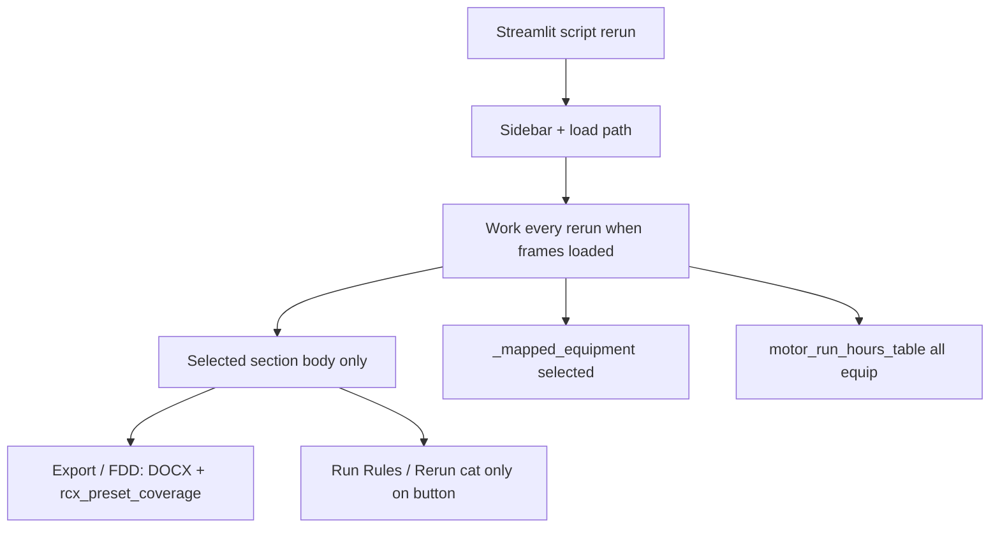

# Streamlit performance bottlenecks (findings)

**Audience:** agents optimizing `vibe_code_apps_19` without deleting features.

**Guardrail:** [`DASHBOARD_CONTRACT.md`](DASHBOARD_CONTRACT.md) analytics golden baseline — `pytest tests/test_analytics_golden.py` must stay green when changing analytics / RCx collectors / rule-batch paths.

This note records **why the app feels slow/clunky**. It is product knowledge — do not “fix” by reintroducing eager work.

---

## Root cause (short)

Streamlit **re-runs the whole script** on most widget interactions. Slowness is mostly **eager heavy work on every visit/rerun**, not missing Rust. Rule math on a large package is legitimately expensive; the UI often paid that cost (or worse) when the user was only switching sections or opening Export.



---

## Ranked findings

| Rank | Bottleneck | Where | Symptom |
| --- | --- | --- | --- |
| 1 | **Export** builds RCx catalog DOCX + `rcx_preset_coverage` (+ other DOCX) into `download_button(data=…)` every visit | `streamlit_app.py` Export section | Opening Export feels like a full analytics run |
| 2 | **FDD Plots** eagerly called `rcx_preset_coverage` for every card visit | `streamlit_app.py` FDD Plots | Large packages stall before cards appear |
| 3 | **Folder mode**: `cached_building_folder` + `_commit_frames` every rerun | `streamlit_app.py` `_load_from_folder` | `@st.cache_data` returns a **fresh copy** of all frames → copy storm on each widget click |
| 4 | **Rule batch**: per-equip role-map/`occ` copies + per-rule `merge_weather` copy + fat `plot_series` in `session_state` | `runner.py` / `_run_rule_list` | “Run all” / prerun RAM + CPU; O(equip × rules) |
| 5 | **Every-rerun** `_mapped_equipment(selected)` + `motor_run_hours_table` (totals often unused) | `streamlit_app.py` `main()` after frames | Paid even on RCx / Export |
| 6 | `collect_oat_scatter` **`iterrows`** path | `rcx_plots.py` | Slow scatters + coverage scans |
| 7 | Multi-equip Plotly **N × max_points** traces | `charts.py` | Clunky UI / low-RAM risk on big VAV fleets |
| 8 | Data Model / FDD DOCX bytes built for download widgets every visit | Data Model / FDD Plots | Same anti-pattern as Export (smaller) |

Zip load-on-button and rule-only-on-Run are already better than Folder/Export eager paths.

---

## What is already fixed (do not regress)

| Fix | Notes |
| --- | --- |
| Lazy main **radio** sections (not eager `st.tabs`) | Reintroducing `st.tabs` that evaluate every pane risks **SIGSEGV** on low-RAM hosts |
| Sidebar sliders in `@st.fragment` | Slider drag must not re-run all rules |
| Rules only on **Run** / **Rerun cat.** / prerun / bootstrap | Not on every slider move |
| One Plotly at a time on **FDD Plots** | Chart panel + cards; downsample traces only |
| **RCx Plots**: family → single preset; **Prepare** catalog DOCX; coverage **opt-in**; generic picker gated | See [`RCX_PLOTS.md`](RCX_PLOTS.md) |
| Overview-only weekly motor + cool bins (partial) | Do not move heavy Overview analytics into every section |

---

## Still open (safe follow-ups — preserve features)

Use analytics goldens before/after. Prefer mirror RCx’s prepare-then-download pattern.

1. **Export / FDD Plots / Data Model** — lazy Prepare → session bytes → download; never rebuild DOCX/coverage in `data=` of download buttons on every visit.
2. **FDD Plots** — drop eager `rcx_preset_coverage` (cards tolerate missing coverage) or cache under opt-in.
3. **Folder mode** — skip rematerialize when path/mtime fingerprint matches committed session frames.
4. **Gate** full `motor_run_hours_table` to Overview; drop unused totals on every rerun.
5. **Rule batch** — one weather-merged frame per equipment reused across rules (**isolate OAT-METEO** mutations); slim stored `RuleResult` (rebuild `plot_series` when charting).
6. **Vectorize** `collect_oat_scatter` (no `iterrows`).
7. **RCx overlay series budget** — plot top-N with “Show all” toggle; keep full summary CSV.

**Do not:** downsample rule math / fault confirmation; remove sections/presets/cards; reintroduce eager tabs.

---

## Semantics risk

| Change | Risk to FAULT/PASS |
| --- | --- |
| Lazy DOCX / coverage / folder skip rematerialize | None (UI timing only) |
| Reuse `merge_weather` per equipment | Low if OAT-METEO stays isolated |
| Slim `plot_series` in session | Compute unchanged if charts rebuild from same frame |
| Vectorize scatters | RCx/coverage only — match points |
| Operational gates / confirm windows | **Would change semantics** — out of scope for “make it faster” |

---

## How to measure

```text
python -m pytest -q tests/test_analytics_golden.py -s
```

Prints soft `load_s` / `analytics_s` / `rcx_s` / `rules_s`. Absolute seconds fail only if `VIBE19_ASSERT_ANALYTICS_MAX_S` is set.

Manual UI: open Export / FDD Plots / toggle a sidebar control on a large package — should not feel like a full RCx catalog rebuild after Phase A lazy fixes.
