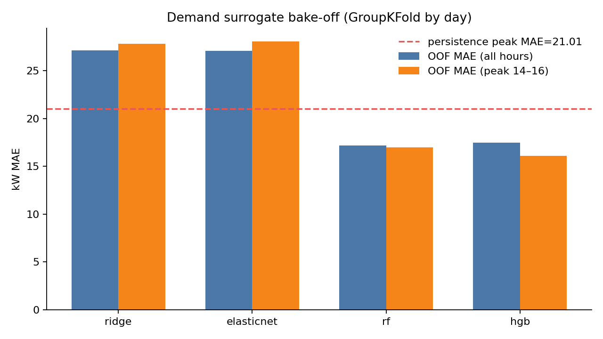
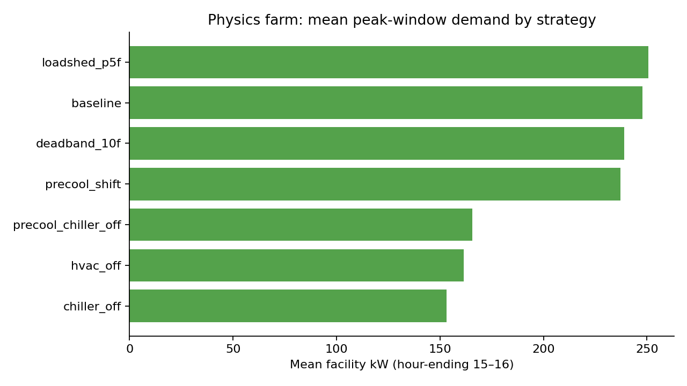
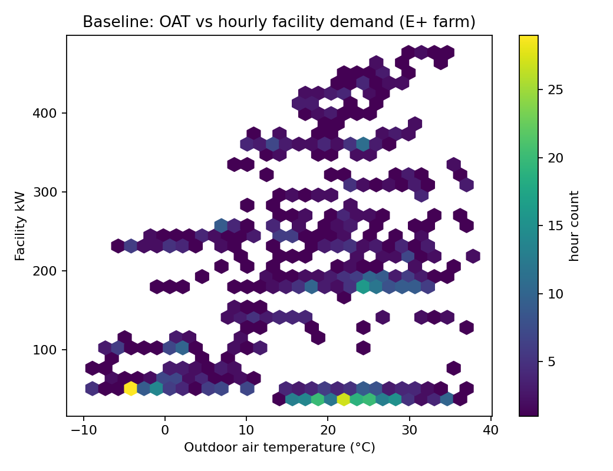
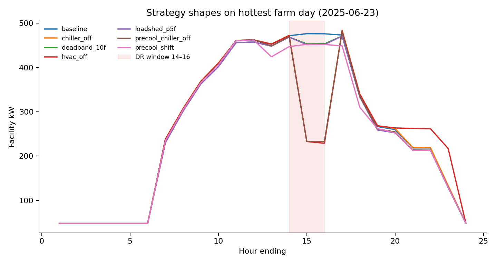

# Demand-management hourly surrogate — EnergyPlus farm results

**Status:** `CANDIDATE` · **Source:** `ENERGYPLUS_SIMULATED` · **Engine:** `native`

## Abstract

This note documents a control-oriented **hourly facility electric demand** surrogate trained on EnergyPlus single-day demand-response (DR) simulations of a G14-calibrated Building 100 Twin (`geo_b100_dual_ahu_shape_ops11`). The surrogate is intended for Unity digital-twin scrubbing of HVAC demand strategies (precool / deadband / plant shed), not for investment-grade M&V.

## Experimental design

- **Physics engine:** native EnergyPlus (`ENERGYPLUS_SIMULATED` rows).
- **Weather:** AMY EPW stratified calendar days (cool / mild / hot / extreme × weekday/weekend).
- **Farm size:** 40 days · 7 strategies · **4,560** hourly rows.
- **Strategies:** baseline, precool_shift, deadband_10f, chiller_off (+ loadshed / HVAC off / precool+chiller on a subset of days).
- **Features:** OAT, RH, hour, occupancy, DR phase, action knobs, same-day lags (no future leakage; GroupKFold by **day**).
- **Model search:** Ridge, ElasticNet, RF, **ExtraTrees** (expanded: `max_features`, `min_samples_split`, `max_leaf_nodes`, `bootstrap`, `n_estimators`≤400), GBR, HGB, Voting, Stacking via `RandomizedSearchCV` (GroupKFold).

## Champion model

| Item | Value |
| --- | --- |
| Family | `extra_trees` (`ExtraTreesRegressor`) |
| Best params | `n_estimators=200`, `min_samples_split=5`, `min_samples_leaf=1`, `max_features=0.8`, `max_depth=10`, `bootstrap=False` |
| OOF MAE (peak 14–16) | **~11.94 kW** (beats persistence ~21.01 kW) |
| Also tried | Ridge, ElasticNet, RF, GBR, HGB, Voting, Stacking (+ champion refine) |
| Artifact (turnkey) | `flask_app/models/demand_hourly_v1.joblib` |

**Data note:** farm is **40 stratified days × strategies ≈ 4,560 hourly rows** — not a full year of 8,760 hours.

**Target:** `facility_kw`. **Explainers:** 29 `FEATURE_COLS` (weather, DR knobs, same-day lags, strategy/phase one-hots).

**Notebook:** `notebooks/demand_hourly_training_walkthrough.ipynb` (Kaggle-style CV / residual / importance plots). Read-only HTML: Flask `GET /notebooks/demand_hourly`. Dump path for agents/CLI: `flask_app/models/` (`ml/artifact_paths.py`).

## Figures

### Model bake-off



### Peak demand by strategy (physics)



### Baseline OAT–demand density



### Hot-day strategy shapes



## Peak-window strategy means (physics)

| Strategy | Mean kW (14–16) | Δ vs baseline (kW) |
| --- | ---: | ---: |
| `chiller_off` | 153.1 | 94.7 |
| `hvac_off` | 161.4 | 86.3 |
| `precool_chiller_off` | 165.5 | 82.3 |
| `precool_shift` | 237.1 | 10.7 |
| `deadband_10f` | 238.9 | 8.9 |
| `baseline` | 247.8 | 0.0 |
| `loadshed_p5f` | 250.6 | -2.8 |

## Leaderboard (out-of-fold)

| Family | MAE | Peak MAE | Beats persistence |
| --- | ---: | ---: | --- |
| `ridge` | 27.11 | 27.79 | False |
| `elasticnet` | 27.07 | 28.03 | False |
| `rf` | 17.17 | 16.99 | True |
| `hgb` | 17.44 | 16.08 | True |

## Multi-target twin I/O (v2)

**Status:** `CANDIDATE` · **Farm profile:** `pilot` · **Artifact:** `flask_app/models/demand_hourly_v2.joblib`

Additive ExtraTrees multi-output model over schema `vibe21.dm_hourly_row.v2` (23 targets: `facility_kw`, `cooling_kw`, AHU1/2 DAT/mix/RA/OA + fan PLR + OA frac, zone means, CHW/CW/tower). Fan/pump/tower PLR columns are **day-normalized electricity rates** (E+ does not emit Part Load Ratio for these objects without advanced diagnostics).

| Item | Value |
| --- | --- |
| Train rows | 360 (3 days × core+extras, ENERGYPLUS_SIMULATED) |
| Champion | `extra_trees` multi-output |
| OOF MAE mean (all targets) | ~3.45 |
| OOF MAE peak facility_kw | ~32.5 kW (pilot is thinner than 40-day v1) |
| API | `POST /api/v1/predict/demand_hourly` → `facility_kw` + `twin_io` |
| Unity | `TwinIoHub` + roof spreadsheet sheets |

**Honesty:** card must say `farm_profile=pilot` vs `full`. Re-farm overnight before claiming parity with the 40-day facility-only champion:

```bash
python tools/dm_hourly_farm.py --engine native --n-days 40 --n-full 10
python -m ml.tune_demand_hourly --multi-target
```

Loader prefers `demand_hourly_v2` then falls back to `demand_hourly_v1`.

## Honesty / limitations

- Model status remains **CANDIDATE** until validated against measured BAS DR days.
- Twin is Floor×AHU lumped zones (not room-level). Comfort / unmet hours are only partially labeled.
- Screening surrogate for Unity / operator what-if — **not** a bid or M&V claim.
- Synthetic EnergyPlus inherits Twin calibration error (G14 PASS on utility bills ≠ perfect hourly truth).
- Pilot multi-target farm is thinner than the 40-day v1 facility champion.

## Reproduce

```bash
python vibe_code_apps_21/tools/dm_hourly_farm.py --pilot --engine native --out-dir ~/wattlab_workspace/reports/dm_hourly_farm_pilot
python -m ml.tune_demand_hourly --multi-target --parquet ~/wattlab_workspace/reports/dm_hourly_farm_pilot/dm_hourly_rows.parquet
# Full facility-only path (v1):
python vibe_code_apps_21/tools/dm_hourly_farm.py --engine native --reuse-existing
python -m ml.tune_demand_hourly
```

*Generated from farm `dm_hourly_farm_pilot` · model cards `demand_hourly_v1` + `demand_hourly_v2`.*
