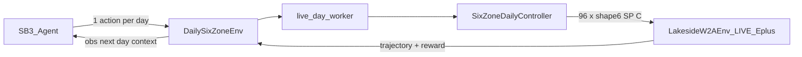

# RL Daily Six-Zone DSM (LIVE EnergyPlus) Implementation Plan

> **Status: SHIPPED** (2026-08-13) · commit `76caa79b` · PR [#90](https://github.com/bbartling/py-bacnet-stacks-playground/pull/90) · CI **PASS**  
> SoT verdict: [`RL_DAILY_DSM.md`](RL_DAILY_DSM.md) · Build plan: [`RL_DAILY_SIX_ZONE_BUILD_PLAN.md`](RL_DAILY_SIX_ZONE_BUILD_PLAN.md)

> **For agentic workers:** This plan is **complete**. Do not re-implement. Extend only via deeper LIVE bakeoff budgets or optional RLlib later. Use skill [`../skills/rl-daily-dsm/SKILL.md`](../skills/rl-daily-dsm/SKILL.md).

**Goal:** Add a Stable-Baselines3 RL path where each episode is **one real LIVE EnergyPlus day**, the agent chooses **daily heating setpoints + HVAC/occupancy timing** for six BAS zones, and we bake off algorithms with matplotlib plots — keeping the existing CLI coordinate-descent study as the honest baseline comparison.

**Architecture:** Keep the [airboxlab/rllib-energyplus](https://github.com/airboxlab/rllib-energyplus)-shaped Gymnasium `EnergyPlusEnv` + threaded runner. Add a **day-MDP wrapper** that maps one RL `step()` to one full closed-loop E+ day (96×15-min internal control via `SixZoneDailyController`). Train with **Stable-Baselines3** (PPO continuous + DQN discrete). Every training and eval episode is `LIVE_ENERGYPLUS` — no surrogate, no farm lookup, no synthetic physics. On Windows, each LIVE day runs in a **subprocess** (`eplus_gym/rl/live_day_worker.py`) so torch never coexists with `pyenergyplus` `delete_state`.

**Tech Stack:** Gymnasium, EnergyPlus Python API (existing runner), Stable-Baselines3 + torch (CPU), matplotlib (plots only), existing `eplus_gym` / `six_zone_daily_controller` / `objective` / `tariff_contract`.

## Global Constraints

- Claim label on all RL artifacts: **ENERGYPLUS DSM OPTIMIZATION SCREENING / RETROSPECTIVE REPLAY** (not operational MPC / BACnet / verified savings).
- Simulator flag: reject anything other than `LIVE_ENERGYPLUS`.
- Champion IDF never mutated; stage six DualSP schedules on copies only.
- Six-zone actuation gate must remain READY before RL campaigns.
- Episode = **exactly one weather day** (96 scored `kind_of_sim==3` rows).
- Action = **daily policy vector** (setpoints + occupancy/HVAC times), not per-timestep °F writes from the RL agent.
- Results visualization: **matplotlib only** → save under `{SITE}/reports/eplus_gym/rl/<run_id>/plots/` (and repo `vibe_code_apps_22/plots/` for unit/smoke charts). No Streamlit/Plotly product UI.
- Keep `scripts/vibe22.py` coordinate-descent path untouched as baseline comparator.
- Prefer contributing-clean env/runner APIs aligned with rllib-energyplus (clear abstract methods, queue protocol, no wonky first-handle-only leftovers).

---

## Locked MDP design

### Observation (start-of-day context)

Fixed-length `float32` vector, e.g.:

- Calendar: month, day-of-week, day-of-year (normalized)
- Weather preview from EPW for that day: mean/min/max OAT °C (96 samples) — **from EPW file**, not invented
- Prior-day summary if available in campaign (peak_kw, kwh) else zeros
- Static site setpoints from Site Config (occ/unocc defaults)

### Action (daily)

Map to [`SixZoneDailyParams`](../eplus_gym/six_zone_daily_controller.py):

| Channel | Meaning | Bounds (locked) |
| --- | --- | --- |
| `occupied_heating_f` | Global occupied heat SP | 68–72 °F |
| `unoccupied_heating_f` | Global unocc / setback base | 58–68 °F |
| `occupancy_start_step` | People/HVAC occupied start (15-min index) | 20–40 (05:00–10:00); school start locked at step **32 = 08:00** for comfort |
| `occupancy_end_step` | Occupied end | 60–80 |
| `recovery_start_minutes_before_occupancy` | HVAC lead before start | 0–180 min |
| Per-zone `setback_offset_f` ×6 | Zone setback vs global unocc | −3…+1 °F |

- **PPO:** `Box` continuous (same dims), clipped + quantized to valid schedule steps on apply.
- **DQN:** flat Discrete(64) — unocc × recovery × shared setback (occ SP frozen 70; window near defaults).

### Reward (end of day, single scalar)

\[
R = -\big(C_{\mathrm{energy}} + C_{\mathrm{peak}}\big) - \lambda_{\mathrm{comfort}}\,V_{\mathrm{pre8}} - \lambda_{\mathrm{occ}}\,V_{\mathrm{occ}}
\]

School start time locked: **08:00 local = step 32**. Fail-closed on E+ crash.

---

## File map (shipped)

| Path | Role |
| --- | --- |
| `eplus_gym/rl/daily_env.py` | `DailySixZoneGymEnv` — 1 step = 1 LIVE day |
| `eplus_gym/rl/live_day_worker.py` | subprocess LIVE day (no torch) |
| `eplus_gym/rl/reward.py` | cost + pre-8AM comfort reward |
| `eplus_gym/rl/spaces.py` | action encode/decode ↔ `SixZoneDailyParams` |
| `eplus_gym/rl/train_sb3.py` | SB3 train/bakeoff (PPO, DQN) |
| `eplus_gym/rl/compare_baseline.py` | RL vs `vibe22` coordinate-descent |
| `eplus_gym/rl/plots.py` | matplotlib savers only |
| `scripts/vibe22_rl.py` | CLI: `train` / `bakeoff` / `compare` |
| `plots/` + site `reports/eplus_gym/rl/<run_id>/plots/` | Chart outputs |
| `requirements-rl.txt` | SB3 + torch CPU |
| `vibe22_agent_spec/RL_DAILY_DSM.md` | Spec + honesty + verdict |
| `vibe22_agent_spec/CONTRIBUTING_RL.md` | Upstream hygiene |
| Keep `scripts/vibe22.py` | Coordinate-descent baseline (unchanged) |

---

## Task 1: Spec + honesty + deps — DONE

**Files:** `vibe22_agent_spec/RL_DAILY_DSM.md`, `requirements-rl.txt`, `AGENTS.md`

- [x] Write spec: episode=day, LIVE only, action table, reward equations, school start 08:00, matplotlib plots path, baseline comparison.
- [x] Add `requirements-rl.txt`: `stable-baselines3`, `torch` (CPU), `tensorboard` optional.
- [x] Document: `pip install -r requirements.txt -r requirements-rl.txt`.
- [x] Shipped in `76caa79b` (combined RL commit).

---

## Task 2: Action/reward pure modules (TDD, no E+) — DONE

**Files:** `eplus_gym/rl/spaces.py`, `eplus_gym/rl/reward.py`, `tests/test_rl_daily_spaces_reward.py`

- [x] Encode/decode round-trip, bound clipping, school-start step=32.
- [x] Reward: higher kWh/peak → lower R; cold zone at 08:00 → large penalty; fail-closed.
- [x] CI unit tests (no E+).

---

## Task 3: `DailySixZoneGymEnv` (real E+) — DONE

**Files:** `eplus_gym/rl/daily_env.py`, `eplus_gym/rl/live_day_worker.py`, `tests/test_rl_isolate_default.py`

- [x] Env `reset` / `step` length-1 MDP; stages six-zone IDF; `LakesideW2AEnv(six_zone_actuators=True)`.
- [x] Default `isolate_eplus=True` (subprocess worker).
- [x] LIVE smoke via `vibe22_rl.py` (not required in CI).

---

## Task 4: Matplotlib plots helpers — DONE

**Files:** `eplus_gym/rl/plots.py`, `plots/.gitkeep`

- [x] `plot_learning_curve`, `plot_day_facility_kw`, `plot_zone_temps_vs_sp`, `plot_algo_bakeoff_bars`, `plot_rl_vs_baseline`.

---

## Task 5: SB3 training + bakeoff CLI (all LIVE) — DONE

**Files:** `eplus_gym/rl/train_sb3.py`, `scripts/vibe22_rl.py`

- [x] `train` / `bakeoff` / `compare`; refuse non-`LIVE_ENERGYPLUS`.
- [x] Artifacts under `reports/eplus_gym/rl/<run_id>/`.

---

## Task 6: Compare to coordinate-descent baseline — DONE

**Files:** `eplus_gym/rl/compare_baseline.py`

- [x] LIVE compare: site baseline / RL / coordinate descent; plots + `compare_summary.json`.

---

## Task 7: rllib-energyplus hygiene — DONE

**Files:** `eplus_gym/train_rllib.py`, `vibe22_agent_spec/CONTRIBUTING_RL.md`, `EPLUS_GYM.md`, skills

- [x] `train_rllib.py` pointer stub → SB3 CLI.
- [x] `CONTRIBUTING_RL.md` differences (day-MDP, six DualSP, SB3, subprocess isolation).

---

## Task 8: Real acceptance campaign — DONE (smoke budget)

- [x] Six-zone actuation gate READY (precondition).
- [x] LIVE bakeoff `bakeoff_smoke_20260126` (`timesteps=2` PPO+DQN) @ sp_creekside.
- [x] LIVE compare vs coordinate-descent study.
- [x] Artifacts: models, plots, summaries, hashes.
- [x] Verdict table in `RL_DAILY_DSM.md`.
- [x] Commit/push `76caa79b`; CI `vibe22-ci` **PASS**.

Optional deeper campaigns (30+/algo, multi-day holdout) are **follow-on**, not blockers.

---

## Out of scope

- BACnet writes / Site Config auto-promote
- Streamlit UI
- Surrogate / farm-lookup “RL”
- Verified tariff savings claims
- Full RLlib multi-worker cluster (optional later)

---

## Done when — all met

1. `DailySixZoneGymEnv` completes real one-day E+ episodes with six-zone actuators.
2. PPO and DQN bakeoff artifacts + matplotlib plots exist on disk.
3. RL vs coordinate-descent comparison table/plots exist for Jan26.
4. Spec/verdict documents honesty and LIVE-only constraint.
5. Unit tests for spaces/reward pass in CI without E+; LIVE smoke documented for agents with EnergyPlus installed.
