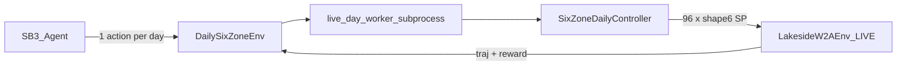

# RL daily six-zone DSM (LIVE EnergyPlus + Stable-Baselines3)

> **Status: SHIPPED** (2026-08-13) · commit `76caa79b` · PR [#90](https://github.com/bbartling/py-bacnet-stacks-playground/pull/90) · CI `vibe22-ci` **PASS**  
> Spec + verdict: [`RL_DAILY_DSM.md`](RL_DAILY_DSM.md) · Skill: [`../skills/rl-daily-dsm/SKILL.md`](../skills/rl-daily-dsm/SKILL.md)

## Scientific claim (locked)

Every RL artifact and CLI banner must state exactly:

**ENERGYPLUS DSM OPTIMIZATION SCREENING / RETROSPECTIVE REPLAY**

Not operational MPC, verified savings, or BACnet. Simulator: **LIVE_ENERGYPLUS only** — no farm lookup, no surrogate, no synthetic physics.

## Locked MDP

- **Episode** = one weather day (96 scored `kind_of_sim==3` rows)
- **Action** = daily policy → [`SixZoneDailyParams`](../eplus_gym/six_zone_daily_controller.py): occ/unocc °F, occupancy start/end steps, recovery lead, per-zone setback offsets
- **School start** = **08:00 = step 32**; negative reward if any of 6 BAS zones cold by then
- **Reward** = `-(C_energy + C_peak) - λ_pre8 * V_pre8 - λ_occ * V_occ`; E+ fail → large negative (fail-closed)
- **Plots** = matplotlib only → `{SITE}/reports/eplus_gym/rl/<run_id>/plots/` and repo `plots/`
- **Process model** = SB3/torch trainer process; each LIVE day in **subprocess** (`live_day_worker`) — torch + E+ `delete_state` heap-corrupts in-process on Windows

Aligned with [airboxlab/rllib-energyplus](https://github.com/airboxlab/rllib-energyplus) Gym+runner shape; **shipped trainer = Stable-Baselines3** (PPO continuous + DQN discrete), not RLlib.

## Keep as baseline

[`scripts/vibe22.py`](../scripts/vibe22.py) six-zone coordinate descent remains untouched; RL compare uses it as the honest non-RL comparator.

## Implementation order (all done)

1. ~~Spec + `requirements-rl.txt`~~
2. ~~Spaces + reward (unit tests, no E+)~~
3. ~~`DailySixZoneGymEnv` (real E+)~~
4. ~~Matplotlib plot helpers~~
5. ~~`vibe22_rl.py` train / bakeoff (all LIVE)~~
6. ~~Compare vs coordinate descent~~
7. ~~rllib-energyplus hygiene docs~~
8. ~~LIVE acceptance → commit/push after PASS~~

Detailed checklist: [`RL_DAILY_DSM_DETAILED_PLAN.md`](RL_DAILY_DSM_DETAILED_PLAN.md) · mirror [`../docs/superpowers/plans/2026-08-13-rl-daily-six-zone-dsm.md`](../docs/superpowers/plans/2026-08-13-rl-daily-six-zone-dsm.md)

## File map (shipped)

| Path | Role |
| --- | --- |
| `eplus_gym/rl/daily_env.py` | 1 step = 1 LIVE day |
| `eplus_gym/rl/live_day_worker.py` | subprocess LIVE day (no torch) |
| `eplus_gym/rl/spaces.py` | action ↔ SixZoneDailyParams |
| `eplus_gym/rl/reward.py` | cost + pre-8AM comfort |
| `eplus_gym/rl/train_sb3.py` | SB3 PPO/DQN |
| `eplus_gym/rl/plots.py` | matplotlib savers |
| `eplus_gym/rl/compare_baseline.py` | RL vs vibe22 descent |
| `scripts/vibe22_rl.py` | CLI |
| `requirements-rl.txt` | SB3 + torch CPU |
| `vibe22_agent_spec/RL_DAILY_DSM.md` | Spec + verdict |
| `vibe22_agent_spec/CONTRIBUTING_RL.md` | Upstream hygiene notes |

## Action bounds (locked)

| Channel | Bounds |
| --- | --- |
| occupied_heating_f | 68–72 °F |
| unoccupied_heating_f | 58–68 °F |
| occupancy_start_step | 20–40 |
| occupancy_end_step | 60–80 |
| recovery_lead_min | 0–180 |
| zone setback_offset_f ×6 | −3…+1 °F |

## LIVE acceptance evidence (smoke)

| Run | Site artifact |
| --- | --- |
| PPO train `timesteps=2` | `reports/eplus_gym/rl/smoke_ppo_20260126/` |
| PPO+DQN bakeoff | `reports/eplus_gym/rl/bakeoff_smoke_20260126/` (winner DQN @ mean_reward) |
| Compare vs descent | same run `compare_summary.json` + plots |

Deeper bakeoffs (30+/algo, holdout days) remain optional campaign work — not required to call the build **DONE**.

## Out of scope (still)

- Surrogate / lookup “RL”
- Streamlit / Plotly product UI
- BACnet / Site Config auto-promote
- Verified-tariff savings claims
- Full RLlib multi-worker (optional later)

## Done when — checklist

1. Real one-day E+ episodes with six actuators — **PASS**
2. PPO+DQN bakeoff artifacts + matplotlib PNGs on disk — **PASS**
3. RL vs coordinate-descent Jan26 comparison — **PASS**
4. Spec/verdict documents LIVE-only honesty — **PASS**
5. Unit tests for spaces/reward pass in CI without E+ — **PASS** (`vibe22-ci` green @ `76caa79b`)
