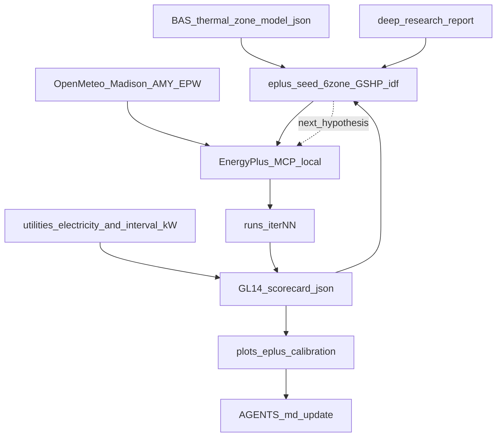

# Lakeside EnergyPlus calibration plan (6-zone GSHP → GL14)

**Site:** southern Wisconsin district Lakeside ES (`sp_lakeside`)  
**Engine:** Local [EnergyPlus-MCP](https://github.com/LBNL-ETA/EnergyPlus-MCP) (source install at `../EnergyPlus-MCP`, EnergyPlus **26.1.0** at `C:\EnergyPlusV26-1-0`) — **not Docker** (WSL/Docker Desktop broken on this machine).  
**Calibration target:** ASHRAE Guideline 14 monthly electricity — **|NMBE| ≤ 5%** and **CVRMSE ≤ 15%** (same gates as vibe20 [`wattlab/calibrate.py`](C:/Users/ben/Documents/py-bacnet-stacks-playground/vibe_code_apps_20/wattlab/calibrate.py)).  
**Budget:** ~**30** published modeling iterations (one hypothesis per run), then stop with best scorecard + honesty stamps.  
**End goal:** Demand-flexibility / DSM hourly sims on the **same 6 BAS thermal zones**.

Locked defaults (sparse site — from [`deep-research-report.md`](deep-research-report.md) + BAS, not invented silently):

| Input | Value | Source |
| --- | --- | --- |
| Gross floor area | **91,210 ft²** | Deep-research (assessor); replace `utilities/campus.json` 80k placeholder |
| Conditioned area | **89,400 ft²** (98% of gross) | Deep-research estimate |
| Floors / massing | 2 story; ~60/40 first/second (54.7k / 36.5k) | Deep-research |
| Thermal zones | **6** = BAS Areas | `thermal_zone_model.json` |
| HVAC family | Distributed **GSHP** W2A + DOAS + condenser loop | BAS 67 HPs + GEO_LOOP; deep-research |
| Sizing | EnergyPlus **autosize** until nameplates known | Honest: autosize ≠ existing capacity |
| Occupancy schedule | School day 7:30–2:40 (Thu 1:30); office 7–15 | Deep-research |
| Electric “bills” | Integrated 5-min demand → monthly kWh | `utilities/electricity.csv` |
| Demand window | 2025-08-01 → 2026-07-03 | AGENTS.md |
| Weather (calibrate) | Madison **AMY** EPW from Open-Meteo over bill months | vibe20 AMY pattern |
| Weather (screen) | Madison MSN TMY3/TMYx EPW (download once) | Not in E+ stock WeatherData |

---

## Architecture



**Layering (match vibe20 sparse playbook):**

| Layer | Owns |
| --- | --- |
| EnergyPlus 26.1 | Physics, autosize, meters, CSV/HTML |
| EnergyPlus-MCP | load / validate / modify_people·lights·equipment / infil / run / plots |
| `sp_lakeside` scripts + agent | Assumption ledger, bill/demand compare, GL14, iteration plots, AGENTS.md |

Do **not** require vibe20 Docker for this campaign. Reuse vibe20 **math** (NMBE/CVRMSE formulas) by copying small helpers into `sp_lakeside/scripts/eplus_gl14.py` so this repo stays runnable offline.

---

## Zoning contract (67 HPs → 6 zones)

Use exact ids from [`clean_data/LAKESIDE_ES/thermal_zone_model.json`](clean_data/LAKESIDE_ES/thermal_zone_model.json):

| Zone id | Floor | HPs | Area share (by HP count) | Modeled ft² (of 89,400 conditioned) |
| --- | --- | --- | ---: | ---: |
| `1F_Area_A` | 1 | 15 | 15/67 | ~20,015 |
| `1F_Area_B` | 1 | 10 | 10/67 | ~13,343 |
| `1F_Area_C` | 1 | 10→11 | 11/67 | ~14,678 |
| `1F_Area_D` | 1 | 10 | 10/67 | ~13,343 |
| `2F_Area_A` | 2 | 11 | 11/67 | ~14,678 |
| `2F_Area_B` | 2 | 10 | 10/67 | ~13,343 |

Each E+ thermal zone = one **ZoneHVAC:WaterToAirHeatPump** (or equivalent packaged GSHP object set) representing the **lumped** Area HPs — not 67 explicit units. Condenser water loop + `GroundHeatExchanger:*` (autosized bore proxy) shared plant. DOAS or OA mixer per deep-research preliminary recommendation.

Stamp on every run: `zone_map_version`, HP counts, area method=`hp_count_weighted`.

---

## Observed electric targets (utility-style)

Already produced by `process_lakeside.py`:

- Monthly energy: `utilities/electricity.csv` — Σ (5-min `kw_demand` × 5/60) per America/Chicago bill month  
- Interval: `utilities/demand_interval_kw.csv` and meter `history_wide.csv`

**Add for demand calibration (new script):**

- `reports/eplus/observed_monthly_peak_kw.csv` — max 5-min (or hourly avg) kW per month  
- Align sim Facility electric meters to same calendar months (partial **2026-07** is short — exclude or flag in scorecard)

GL14 primary gate = **monthly kWh**. Secondary (DSM readiness) = monthly peak kW NMBE/CVRMSE with looser reporting thresholds (document; do not fail G14 solely on peak until model shape is close).

---

## Folder layout (new under `sp_lakeside`)

```text
eplus/
  assumptions/
    ledger.json                 # confidence + knobs per iteration
    answers.json                # locked site facts (area, lat/lon, schedules)
  weather/
    madison_tmy3.epw            # screening
    madison_amy_202508_202607.epw
  models/
    lakeside_6zone_gshp_v0.idf # seed
    lakeside_6zone_gshp_latest.idf
  runs/
    iter_01/ … iter_30/         # idf copy, eplusout*, scorecard.json, notes.md
  scorecards/
    campaign_log.csv            # one row per iteration
  plots/
    gl14_progress_by_iteration.png
    monthly_kwh_model_vs_obs_best.png
    monthly_peak_kw_model_vs_obs_best.png
    monthly_error_heatmap.png
scripts/
  eplus_build_amy_epw.py
  eplus_observed_targets.py     # monthly kWh + peak from interval
  eplus_gl14.py                 # nmbe/cvrmse + pass/fail
  eplus_score_run.py            # parse meters → monthly → scorecard
  eplus_calibration_plots.py
  eplus_seed_6zone.py           # generate/patch seed IDF (eppy or MCP)
```

---

## Iteration ladder (~30 runs)

Follow vibe20 [`SPARSE_BUILDING_PLAYBOOK`](C:/Users/ben/Documents/py-bacnet-stacks-playground/vibe_code_apps_20/vibe20_agent_spec/docs/SPARSE_BUILDING_PLAYBOOK.md) adapted to **local MCP**:

| Iters | Weather | Knobs (one primary change each) | Goal |
| ---: | --- | --- | --- |
| 1–3 | TMY | Seed geometry + GSHP autosize; fix fatals | Runs clean; EUI order-of-magnitude |
| 4–6 | TMY | School schedules (deep-research); LPD/EPD baselines | Weekday diurnal vs BAS demand shape |
| 7–10 | **AMY** | Align RunPeriod to bill window; facility meters | Period match; first G14 scorecard |
| 11–18 | AMY | Infil / LPD / EPD / people multipliers via MCP | Drive monthly kWh toward bills |
| 19–24 | AMY | HP COP / fan power / DOAS OA / setpoints | Winter peak + heating-dominated r≈−0.41 |
| 25–30 | AMY | Fine multipliers + Thursday early dismissal / summer-school diversity | Chase |NMBE|≤5 & CVRMSE≤15 |

**Hard rules**

- One hypothesis per published `runs/iter_NN/`  
- Never invent floor area / city / HVAC family — ledger only  
- Autosized kWh alone ≠ “calibrated” until G14 pass  
- After G14 pass (or best-of-30), freeze `models/lakeside_6zone_gshp_latest.idf` for DSM hourly work  

**MCP tool map (per iteration)**

1. `load_idf_model` / `validate_idf`  
2. `modify_people` | `modify_lights` | `modify_electric_equipment` | `change_infiltration_by_mult` (as needed)  
3. `modify_run_period` / sim settings for AMY window  
4. `add_output_meters` (Facility Electricity, etc.) if missing  
5. `run_energyplus_simulation` with AMY EPW  
6. Local `eplus_score_run.py` + append `campaign_log.csv`  
7. `eplus_calibration_plots.py` refresh  

---

## Plots (vibe20-like deliverables)

1. **`gl14_progress_by_iteration.png`** — dual series: |NMBE|% and CVRMSE% vs iteration; horizontal pass lines at 5% / 15%; annotate first pass or best.  
2. **`monthly_kwh_model_vs_obs_best.png`** — grouped bars model vs observed for best (or latest) iter.  
3. **`monthly_peak_kw_model_vs_obs_best.png`** — same for peak demand.  
4. **`monthly_error_heatmap.png`** — iterations × months % error (kWh).  

All under `eplus/plots/` and copied/summarized into `plots/analytics/` if useful for the site package.

---

## AGENTS.md updates

Extend [`AGENTS.md`](AGENTS.md) with a new section **EnergyPlus twin / GL14 calibration**:

- Deliverable rows: seed IDF, AMY EPW, campaign log, best scorecard, calibration plots  
- Paths table pointing at `eplus/`  
- Prerequisites: local EnergyPlus-MCP + `EPLUS_IDD_PATH=C:\EnergyPlusV26-1-0\Energy+.idd`  
- Run order: observed targets → AMY EPW → seed → iterate via MCP → score/plot  
- Zone roster pointer (already present) + “E+ zones == BAS Areas” contract  
- Honesty: integrated kWh not billing-grade; area from deep-research until FM confirms; autosize caveat  
- Link `deep-research-report.md` as geometry/schedule SoT  
- Update `campus.json` `floor_area_ft2` → **91210** with note “deep-research assessor; was placeholder 80000”  
- Last-validated stamp when campaign completes  

---

## Success criteria

| Gate | Definition |
| --- | --- |
| G14 energy | Monthly kWh \|NMBE\| ≤ 5% and CVRMSE ≤ 15% on overlapping complete months |
| Process | ≥ 1 published run with scorecard for each of ~30 iters (or early stop on pass + 2 confirmation runs) |
| Zoning | 6 zones named/ mapped to BAS Area ids; HP counts stamped |
| MCP | All sims launched via local EnergyPlus-MCP (or same venv `EnergyPlusManager` path documented as MCP-equivalent) |
| Docs | AGENTS.md lists paths + how to resume iteration |
| DSM-ready | Best IDF can run hourly outputs for the 6 zones without re-zoning |

If G14 not met by iter 30: ship **best-effort** scorecard + assumption ledger + “conceptual / not calibrated” stamp (vibe20 honesty), still produce all progress plots.

---

## Implementation order (when approved)

1. Update `utilities/campus.json` area + scaffold `eplus/` + GL14/target scripts  
2. Download Madison TMY; build AMY EPW from Open-Meteo for demand window  
3. Build seed 6-zone GSHP IDF (eppy generator or MCP-edited prototype scaled to 91,210 ft²)  
4. Smoke iter_01 via MCP; fix until green  
5. Agent loop iters 2–30 with ledger + plots after each batch  
6. Update AGENTS.md + copy best artifacts into `reports/` / `plots/analytics/`  
