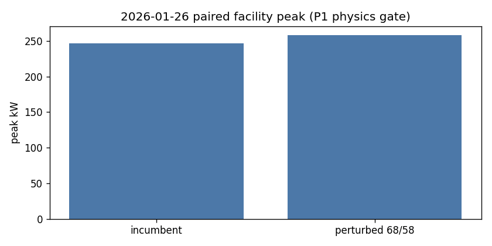

# Vibe22 post-fix RL campaign (2026-08-15)

**Claim:** ENERGYPLUS DSM OPTIMIZATION SCREENING / RETROSPECTIVE REPLAY.

**Verdict:** `NO_GO_INSUFFICIENT_EVIDENCE`

P0 experiment integrity is in code. P1 EnergyPlus subprocess smoke and January 26 paired physics **passed**. A multi-seed train/validation campaign and the locked January test were **not opened**.

Not operationally ready. Not BACnet ready. Not optimized.

## 1. Executive verdict

| Question | Result |
| --- | --- |
| Lookback contamination fixed? | Yes — incumbent/BAS lookback independent of candidate |
| Obs v2? | Yes — 19-D `vibe22.obs.v2` (compact forecast, not 24 hourly OAT in the MDP) |
| Forward split? | Yes — train through 2025-12-14; val 2025-12-15..31; locked Jan 2026; Feb–Mar diagnostic |
| P1 3-day smoke 96/192 Severe=0? | **PASS** (subprocess) |
| P1 Jan 26 physics moves kW/kWh? | **PASS** |
| Repeated actuator-handle warnings? | **0** on P1 smoke (`actuator_handle_warnings` null) |
| W2A low-airflow | Still disclosed / structural |
| Pilot/full PPO-DQN campaign | **NOT RUN** |
| Locked January opened? | **No** |

## 2. Implementation changes

- Fixed incumbent lookback in `SixZoneDailyController.action_lookback`.
- Observation schema `vibe22.obs.v2` (six start-of-day zone F, billing floor, MTD peak, illustrative school-day flag, compact forecast). Old packs fail closed.
- Split manifest v2 with clone-with-source leakage check.
- Operator-pay 2x/3x require paired baseline kWh/peak; display $ vs bounded training reward (`INFEASIBLE_TRAIN_REWARD = -10`).
- Billing epoch reset when cycling the day list; floors keyed by (year, month).
- Runner requests variables once; actuator handles only on RunPeriodWeather with warmup false.
- `vibe22_rl.py train/campaign/eval` require `--reward-name`. `eval` writes `eval_episodes.csv`.
- Contextual-bandit-like daily policy (one action/day). DQN Discrete(64) remains a coarse ablation.

## 3. Lookback before/after

Before: `action_lookback` called `action`, so the candidate schedule ran on D-1.

After: lookback series is always `incumbent_lookback_params()` (70/65, no zone setbacks). Unit test: two extreme candidates share identical lookback actions; target-day actions differ.

## 4. Data split

| Fold | Rule |
| --- | --- |
| train | source date through 2025-12-14 |
| validation | 2025-12-15 through 2025-12-31 |
| locked_test | 2026-01-01 through 2026-01-31 |
| post_test_diagnostic | Feb–Mar 2026 |

Synthetic clones stay with `calendar_fold_key`.

## 5. Commands

```powershell
$env:SITE_ROOT="C:\Users\ben\OneDrive\Desktop\testing\sp_creekside"
cd vibe_code_apps_22
python -m pytest tests -q
python scripts/postfix_p1_gates.py
python scripts/vibe22_rl.py eval --run-id postfix_pilot --days 2026-01-26 --arm incumbent --reward-name legacy_reward_v1 --site-root $env:SITE_ROOT
```

Formal campaign (not executed here) must pass `--reward-name operator_pay_2x_v1` and a new `run_id` ≠ `year2xsyn`.

## 6. EnergyPlus call counts / runtime

P1: 5 subprocess days (3 smoke + incumbent + perturbed) in ~27 s wall on this machine.

Expected full train fold ~136 days; pilot ~950 E+ calls; 3-seed 5-pass ~4100 calls. See `docs/audits/figures/postfix/phase2_campaign.json`.

## 7. Tests

`python -m pytest tests -q` → 57 passed, 1 deselected (`eplus` marker). P1 gates ran outside default pytest.

## 8. Baselines

- Incumbent/BAS: `incumbent_lookback_params()` (70/65).
- Perturbed P1: occupied 68 F / unoccupied 58 F.
- No-setback 70/70 and heuristic/coordinate-descent arms exist in CLI (`eval --arm`) but were not scored on the train fold.

## 9. Reward

`operator_pay_2x_v1` / `3x`: illustrative paycheck; training uses scaled pay; readiness fail → display $0, `infeasible`, train reward −10. Money is ILLUSTRATIVE.

## 10. Pilot / full campaign

**NOT RUN.** Locked January was not opened.

## 11. Paired uncertainty

Not computed (no held-out eval sample).

## 12. Plots

P1 physics:



year2xsyn RL plots remain **INVALID_PRE_FIX_EPLUS_SEVERE — TRAIN EXPLORATION ONLY**.

A04 monthly GL14 is calibration context only, not hourly DSM validation.

## 13. Failure / warning ledger

- W2A <25% rated airflow: still present in EnergyPlus; not tuned away.
- Duplicate actuator-handle warnings: not observed on P1 after handle-once change.
- year2xsyn: 1951×2 Severe DATA PERIOD (historical).

## 14. Artifact paths

| Path | Role |
| --- | --- |
| `docs/audits/figures/postfix/p1_gates.json` | Smoke + pair metrics |
| `docs/audits/figures/postfix/phase2_campaign.json` | NOT_RUN budget |
| `docs/audits/figures/postfix/jan26_paired_peak.png` | Paired peak |

A04 SHA256 pin: `212a2835eabb8b3a316150815a61bc996bf1fda4191df655dbf74f1126132683`.

## 15. Operational recommendation

Do not write BACnet. Do not auto-promote. Offline screening of the **simulator** (P1) is allowed. Do not treat any policy as a screening winner until a validation-only deterministic eval exists.

## Handoff

- Branch: `fix/vibe22-rl-scientific-validity` (PR #91), merge to `develop` after this postfix commit.
- run_id(s): none trained (`postfix_pilot_20260815` reserved, **NOT RUN**).
- Locked January opened: **no**.
- Verdict: `NO_GO_INSUFFICIENT_EVIDENCE`.
- P1 physics: GO (`physics_moved: true`).
- CI: wait for `vibe22-ci` / `python-tests` on the postfix push before merge.
