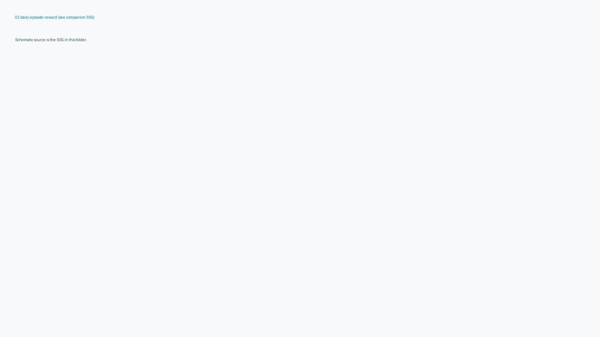
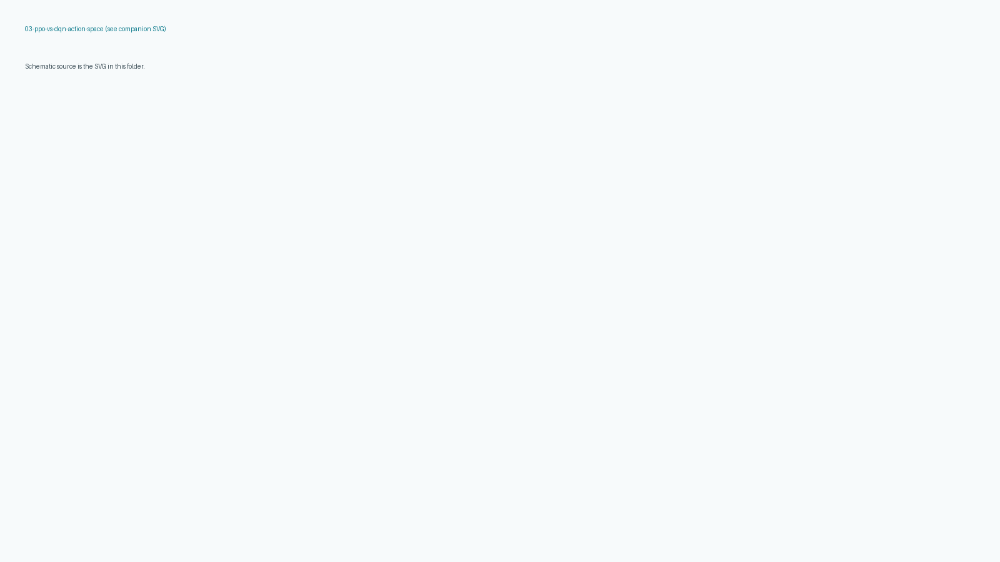
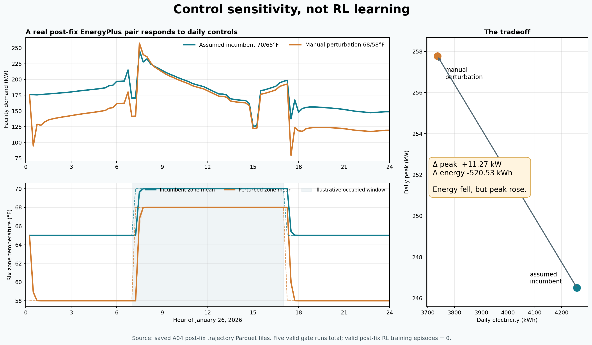
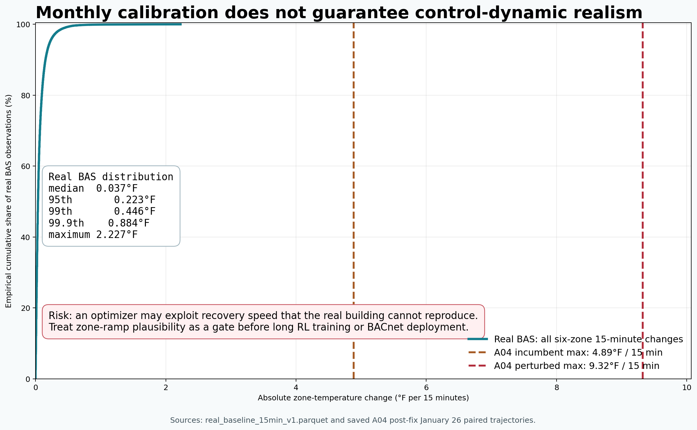

# Vibe22 RL proof-of-concept evidence closure (2026-08-15)

**Allowed claim:** A calibrated EnergyPlus model was wrapped as a six-zone daily DSM learning environment, and five valid post-fix EnergyPlus gate runs proved simulator health and control sensitivity. A valid post-fix RL learning result does not exist yet.

**Base SHA:** `4b71061666d1c34c9c93b3c66fa08e043ae856ae` (`origin/develop`)  
**Branch:** `fix/vibe22-postfix-pilot-readiness`

## Verdicts

| Question | Verdict |
| --- | --- |
| Architecture / simulator POC | `GO_FOR_BLOG_WITH_LIMITATIONS` |
| Learned RL savings | `NO_GO_NOT_TRAINED` |
| Long RL campaign | `NO_GO_PHYSICS_RAMP_GATE` |
| BACnet writes | `NO_GO` |

Long-training gate name: `NO_GO_LONG_RL_TRAINING_PHYSICS_RAMP_IMPLAUSIBLE`. Monthly Guideline 14 screen and the five post-fix gates still stand. No 950/4100-call campaign was started. No smoke-training (ramp gate failed).

## A04 calibration scope

SHA-256 pin: `212a2835eabb8b3a316150815a61bc996bf1fda4191df655dbf74f1126132683`.

Ten-period monthly NMBE ≈ +0.98%, CV(RMSE) ≈ 10.45% is a **monthly partial-period Guideline 14 screen**, not hourly DSM validation.

## Experiment ledger

See [`figures/postfix/experiment_ledger.json`](figures/postfix/experiment_ledger.json).

- `valid_postfix_training_episodes`: 0
- `historical_invalid_training_episodes`: PPO 488, DQN 488 (`year2xsyn`, `INVALID_PRE_FIX_EPLUS_SEVERE`)
- `valid_postfix_eplus_gate_calls`: 5
- `deterministic_validation_episodes`: 0
- `heldout_test_episodes`: 0
- January is **not** a pristine untouched holdout (calibration and P1 used 2026-01-26)

## Five post-fix EnergyPlus gates

Jan 25, Jan 26, Mar 16 smoke (96/192, Severe=0) plus Jan 26 incumbent vs manual 68/58°F perturbation. The pair is **not** an RL policy.

Independently recomputed from committed scored parquets (matches p1_gates.json):

| Arm | Peak kW | kWh |
| --- | --- | --- |
| Incumbent 70/65 | 246.502 | 4257.258 |
| Manual 68/58 | 257.774 | 3736.727 |
| Delta | +11.272 kW | −520.531 kWh |

Jan 26 lookback end-of-D−1 zone temps ≈ **65.00°F** (not 70°F).

## Baseline cache

On-disk schema `vibe22.baseline_cache.v1`, atomic writes, fail-closed provenance, no candidate-as-baseline. One real `operator_pay_2x_v1` candidate day completed without raising: reward −1.5 vs cached incumbent 4257.258 kWh / 246.502 kW. Proof: [`figures/postfix/operator_pay_2x_one_step.json`](figures/postfix/operator_pay_2x_one_step.json).

## Observation / eval

`vibe22.obs.v2` is the **intentional** 19-D policy contract on this branch (lookback start-zone temps plus billing context in the observation). It is **not** `vibe22.obs.v1_16d_no_zone_temps`. Eval no longer uses dummy `dow=0`/`doy=1`/zero weather; sidecar JSON is unnormalized context. Scored parquet remains 96 rows; `trajectory_all.parquet` + `episode_manifest.json` record 192-row provenance.

## Zone-ramp gate

Threshold = BAS p99.9 × 3.0 ≈ **2.65°F / 15 min** (not fitted to A04).

- BAS: median 0.037, p95 0.223, p99 0.446, p99.9 0.884, max 2.227°F
- A04 incumbent max ≈ 4.89°F; perturbed ≈ 9.32°F

Verdict: `NO_GO_LONG_RL_TRAINING_PHYSICS_RAMP_IMPLAUSIBLE`. [`figures/postfix/ramp_gate.json`](figures/postfix/ramp_gate.json).

## Blog images

Caption: manual control perturbation, five valid gates, valid post-fix RL episodes = 0.

Schematics also ship as SVG in the same folder.

## Commands / tests

- `python -m pytest tests -q` (2026-08-16 closeout nits; same selection as CI `vibe22-ci`) → 67 passed, 1 deselected (`eplus` marker). Pre-POC-closure was 57; this branch before nits was 65.
- Figure command in [`../blog/2026-08-15-rl-poc/README.md`](../blog/2026-08-15-rl-poc/README.md)
- This PR EnergyPlus calls: 3-day smoke (Mar 16 retried after a Windows heap `0xC0000374`), Jan 26 pair, one `operator_pay_2x_v1` candidate (plus nested incumbent cache fill) — **not** a campaign

Campaign eval plots remain fail-closed until real `eval_episodes.csv` exists.

## BACnet

Do not write BACnet. Do not auto-promote.

## Merge (2026-08-16)

Squash-merged as **PR #93** → `develop` SHA `1995b52f2eb0a0a9cc5602d95708d21dc441d7b1`. `vibe22-ci` on that push: success (`31948892233`). Feature branch deleted. **POC evidence closed; RL is not production DSM.** No vibe22 GHCR workflow exists.
