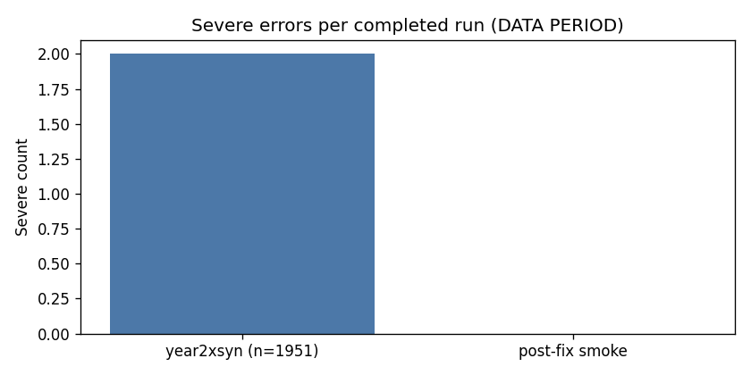
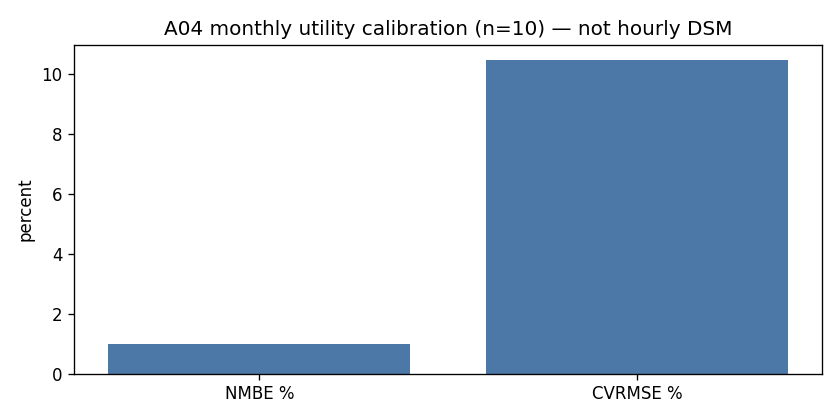
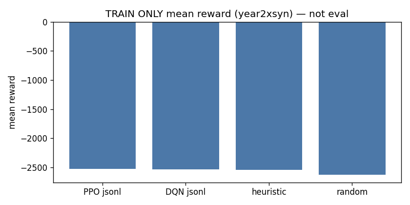

# Vibe22 RL scientific validity and roadmap (2026-08-15)

**Claim:** ENERGYPLUS DSM OPTIMIZATION SCREENING / RETROSPECTIVE REPLAY.

Generated: `2026-08-15T14:30:17.764524+00:00`  
Builder: `scripts/build_vibe22_rl_validity_report.py`

## 1. Executive verdict

| Question | Verdict |
| --- | --- |
| GO for offline screening? | **SCREENING ONLY** (year2xsyn TRAIN frozen; 3-day smoke Severe=0) |
| GO for advisory/shadow? | **NO-GO** (no locked-test deterministic eval; W2A low-airflow structural) |
| GO for BACnet writes? | **NO-GO** |
| GO for nightly automatic promotion? | **NO-GO** |

## 2. Provenance

| Item | Value |
| --- | --- |
| Playground branch | `fix/vibe22-rl-scientific-validity` |
| Champion IDF | `models/eplus/lakeside_w2a_a04_dual_champion.idf` |
| Champion SHA256 | `212a2835eabb8b3a316150815a61bc996bf1fda4191df655dbf74f1126132683` |
| rllib root | `C:\Users\ben\Documents\rllib-energyplus\.worktrees\feat-generic-runner` |
| rllib SHA | `01c5dc7cf55c1c9e33e995f2340b0859563bb045` |
| year2xsyn site winner field | `None` (TRAIN exploration; repo snapshot `winner=null`) |
| EnergyPlus (year2xsyn logs) | 26.1.0 |

## 3. Before vs after defects

| Defect | Before | After (code) |
| --- | --- | --- |
| Lookback `max_steps=96` with `lookback_days=1` | empty scored rows | stage D-1..D, 192 steps, 96 scored |
| Year-less DATA PERIOD | 1951×2 Severe | staged year-aware EPW |
| Readiness fail reward 0 | better than valid negative cost | `operator_pay_2x/3x` uses `READINESS_FAIL_REWARD` |
| `mtd_peak` = yesterday | overwrite | `BillingState` running floor + month reset |
| Held-out flag | hardcoded true | true only with LOCKED_TEST + `*_eval` |
| Sidecar missing pack | silent heuristic | fail closed |
| Vendored rleplus | silent except | fail closed unless flag |

## 4. EnergyPlus quality audit

year2xsyn: **1951** `eplusout.err`, all Completed Successfully, **2 Severe** (DATA PERIOD year missing), W2A low-airflow + duplicate actuator-handle warnings. Elapsed 2–12 s, **1-day RunPeriods**, not lookback.



Post-fix 3-day smoke: days ['2026-01-26', '2026-03-16', '2026-01-25']; n_rows=96 n_all_rows=192; severe=0 fatal=0 epw=madison_amy_202508_202608.epw lookback=1

## 5. A04 calibration context

Monthly utility (n=10): NMBE ≈ **+0.98%**, CVRMSE ≈ **10.45%**. Jan 26 15-min peak ≈ 287.5 kW. **Monthly GL14 is not hourly DSM validation.**



## 6. Reward equations (ILLUSTRATIVE money)

- `legacy_reward_v1`: `-(kWh*rate + peak*demand) - comfort`
- `operator_pay_v1` (historical): incremental demand vs floor; readiness fail → reward **0**
- `operator_pay_2x_v1` / `operator_pay_3x_v1`: same floor for pair; `display_paycheck = clip(100 + k*savings, 0, cap)`; training uses `READINESS_FAIL_REWARD` (`-1e6`) on school readiness fail

## 7. Dataset / splits

Synthetic clones share `calendar_fold_key`. Locked test default months: **2026-01**. Validation: **2026-03**. Do not change after inspecting results.

## 8. Training configuration

Historical year2xsyn: PPO continuous + DQN Discrete(64) ablation; **legacy_reward_v1**; 336 AMY + 151 synthetic. **TRAIN jsonl is not eval.**



## 9. Deterministic evaluation

**NOT RUN** — no post-fix `eval_episodes.csv` / saved-policy locked test. Three-day EnergyPlus **smoke** (not a bakeoff): days ['2026-01-26', '2026-03-16', '2026-01-25']; n_rows=96 n_all_rows=192; severe=0 fatal=0 epw=madison_amy_202508_202608.epw lookback=1

## 10. Learned-policy behavior

Saved PPO on year2xsyn saturates occupied 68°F / unoccupied 58°F / start 20 / end 60 / recovery 0. **Fixed-rule / bound saturation**, not weather-adaptive control.

## 11. Baseline comparisons

**NOT RUN** post-fix (need BAS incumbent + no-setback paired EnergyPlus).

## 12. Failure ledger

year2xsyn heuristic heap: `2025-09-29`, `2026-02-02__syn` (`0xC0000374`).

## 13. Artifact directories

| Location | Role |
| --- | --- |
| `SITE/reports/eplus_gym/rl/year2xsyn` | Frozen historical TRAIN raw |
| `plots/rl_report_year2x` | Git snapshot, `winner=null` |
| `plots/rl_report` | LEGACY unique-100 TRAIN |
| `reports/` | STALE pre-RL scorecards |

## 14. Midnight edge roadmap

Forecast → six BAS zone temps (not in current 16-D obs) → billing floor → proposal JSON → human approval → score next midnight → offline challenger → gated promotion. **No BACnet writes.**

## 15. Limitations / next experiment

W2A low-airflow: NO-GO_SCREENING_ONLY: EnergyPlus prints the W2A <25% rated airflow warning once per run (repeats suppressed). Cannot compute timestep fraction from eplusout.err. Do not retune plant to silence warnings at the cost of GL14/peak.

Phase 9 campaign: NOT_RUN: Three-day EnergyPlus smoke is green (Severe=0, 96/192 rows) but a multi-seed PPO/DQN campaign was not started. New run_id must not be year2xsyn. Locked-test deterministic eval remains NOT RUN.

## 16. Reproduction

```powershell
cd vibe_code_apps_22
python -m pytest tests -q
python scripts/build_vibe22_rl_validity_report.py --out docs/audits/2026-08-15-vibe22-rl-scientific-validity-and-roadmap.md
```

## 17. Tests / CI

See pytest output in the implementing commit. EnergyPlus integration tests are marked `eplus`.

## 18. Final scientific recommendation

**SCREENING ONLY / NO-GO** for advisory, BACnet, and nightly promotion. Smoke Severe/Fatal are zero on three days; W2A airflow and duplicate actuator-handle warnings remain; locked-test eval is NOT RUN.
