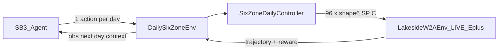

# RL Daily Six-Zone DSM (LIVE EnergyPlus) Implementation Plan

> **For agentic workers:** REQUIRED SUB-SKILL: Use superpowers:subagent-driven-development (recommended) or superpowers:executing-plans to implement this plan task-by-task. Steps use checkbox (`- [ ]`) syntax for tracking.

**Goal:** Add a Stable-Baselines3 RL path where each episode is **one real LIVE EnergyPlus day**, the agent chooses **daily heating setpoints + HVAC/occupancy timing** for six BAS zones, and we bake off algorithms with matplotlib plots — keeping the existing CLI coordinate-descent study as the honest baseline comparison.

**Architecture:** Keep the [airboxlab/rllib-energyplus](https://github.com/airboxlab/rllib-energyplus)-shaped Gymnasium `EnergyPlusEnv` + threaded runner. Add a **day-MDP wrapper** that maps one RL `step()` to one full closed-loop E+ day (96×15-min internal control via `SixZoneDailyController`). Train with **Stable-Baselines3** (PPO continuous + DQN discrete). Every training and eval episode is `LIVE_ENERGYPLUS` — no surrogate, no farm lookup, no synthetic physics.

**Tech Stack:** Gymnasium, EnergyPlus Python API (existing runner), Stable-Baselines3 + torch (CPU), matplotlib (plots only), existing `eplus_gym` / `six_zone_daily_controller` / `objective` / `tariff_contract`.

## Global Constraints

- Claim label on all RL artifacts: **ENERGYPLUS DSM OPTIMIZATION SCREENING / RETROSPECTIVE REPLAY** (not operational MPC / BACnet / verified savings).
- Simulator flag: reject anything other than `LIVE_ENERGYPLUS`.
- Champion IDF never mutated; stage six DualSP schedules on copies only.
- Six-zone actuation gate must remain READY before RL campaigns.
- Episode = **exactly one weather day** (96 scored `kind_of_sim==3` rows).
- Action = **daily policy vector** (setpoints + occupancy/HVAC times), not per-timestep °F writes from the RL agent.
- Results visualization: **matplotlib only** → save under `{SITE}/reports/eplus_gym/rl/<run_id>/plots/` (and repo `vibe_code_apps_22/plots/` for unit/smoke charts). No Streamlit/Plotly product UI.
- Keep `scripts/vibe22.py` coordinate-descent path untouched as baseline comparator.
- Prefer contributing-clean env/runner APIs aligned with rllib-energyplus (clear abstract methods, queue protocol, no wonky first-handle-only leftovers).

---

## Locked MDP design

### Observation (start-of-day context)

Fixed-length `float32` vector, e.g.:

- Calendar: month, day-of-week, day-of-year (normalized)
- Weather preview from EPW for that day: mean/min/max OAT °C (96 samples) — **from EPW file**, not invented
- Prior-day summary if available in campaign (peak_kw, kwh) else zeros
- Static site setpoints from Site Config (occ/unocc defaults)

### Action (daily)

Map to [`SixZoneDailyParams`](vibe_code_apps_22/eplus_gym/six_zone_daily_controller.py):

| Channel | Meaning | Bounds (locked) |
| --- | --- | --- |
| `occupied_heating_f` | Global occupied heat SP | 68–72 °F |
| `unoccupied_heating_f` | Global unocc / setback base | 58–68 °F |
| `occupancy_start_step` | People/HVAC occupied start (15-min index) | 20–40 (05:00–10:00); school start locked at step **32 = 08:00** for comfort |
| `occupancy_end_step` | Occupied end | 60–80 |
| `recovery_start_minutes_before_occupancy` | HVAC lead before start | 0–180 min |
| Per-zone `setback_offset_f` ×6 | Zone setback vs global unocc | −3…+1 °F |

- **PPO:** `Box` continuous (same dims), clipped + quantized to valid schedule steps on apply.
- **DQN:** MultiDiscrete / flat Discrete over a coarse grid (global unocc ∈ {60,62,64,66} × recovery ∈ {0,60,120,180} × 6 zone setback bins) — keep cardinality ≤ ~few thousand by freezing occ SP=70 and occ window to Site Config defaults when using DQN.

### Reward (end of day, single scalar)

Computed from the real E+ trajectory via existing objective helpers:

\[
R = -\big(C_{\mathrm{energy}} + C_{\mathrm{peak}}\big) - \lambda_{\mathrm{comfort}}\,V_{\mathrm{pre8}} - \lambda_{\mathrm{occ}}\,V_{\mathrm{occ}}
\]

- \(C_{\mathrm{energy}} = \mathrm{kWh}\times r_e\) (illustrative rates OK; money never claimed verified)
- \(C_{\mathrm{peak}} = \mathrm{peak\_kW}\times r_d\) (or incremental billing-floor vs MTD if provided)
- \(V_{\mathrm{pre8}}\): degree-hours / interval count where any of 6 BAS zones is below **68 °F** in the window **[occupancy_start, 08:00]** and at **08:00 (step 32)** — “not warm by school start”
- \(V_{\mathrm{occ}}\): occupied comfort violations after 08:00 (lighter weight than pre-8 hard miss)
- Fail-closed: E+ crash / calendar fail → large negative reward + `info["failed"]=True` (never zero-cost fake success)

School start time locked: **08:00 local = step 32**.

---

## File map

| Path | Role |
| --- | --- |
| [`eplus_gym/env.py`](vibe_code_apps_22/eplus_gym/env.py) / [`runner.py`](vibe_code_apps_22/eplus_gym/runner.py) | Light rllib-energyplus alignment cleanup (docs + API hygiene) |
| `eplus_gym/rl/daily_env.py` | **NEW** `DailySixZoneGymEnv` — 1 step = 1 LIVE day |
| `eplus_gym/rl/reward.py` | **NEW** cost + pre-8AM comfort reward |
| `eplus_gym/rl/spaces.py` | **NEW** action encode/decode ↔ `SixZoneDailyParams` |
| `eplus_gym/rl/train_sb3.py` | **NEW** SB3 train/eval entry (PPO, DQN) |
| `eplus_gym/rl/compare_baseline.py` | **NEW** RL winner vs `vibe22` coordinate-descent artifacts |
| `eplus_gym/rl/plots.py` | **NEW** matplotlib savers only |
| `scripts/vibe22_rl.py` | **NEW** CLI: `train` / `eval` / `bakeoff` / `compare` |
| `plots/` + site `reports/eplus_gym/rl/<run_id>/plots/` | Chart outputs |
| `requirements-rl.txt` | SB3 + torch CPU extras (keep core `requirements.txt` slim) |
| `vibe22_agent_spec/RL_DAILY_DSM.md` | Spec + honesty |
| Keep [`scripts/vibe22.py`](vibe_code_apps_22/scripts/vibe22.py) | Coordinate-descent baseline (unchanged) |

---

## Task 1: Spec + honesty + deps

**Files:** `vibe22_agent_spec/RL_DAILY_DSM.md`, `requirements-rl.txt`, `AGENTS.md` (short pointer)

- [ ] Write spec: episode=day, LIVE only, action table, reward equations, school start 08:00, matplotlib plots path, baseline comparison.
- [ ] Add `requirements-rl.txt`: `stable-baselines3`, `torch` (CPU), `tensorboard` optional for SB3 logs (plots still matplotlib).
- [ ] Document: `pip install -r requirements.txt -r requirements-rl.txt`.
- [ ] Commit: `docs(vibe22): add LIVE RL daily six-zone DSM spec and RL extras`.

---

## Task 2: Action/reward pure modules (TDD, no E+)

**Files:** `eplus_gym/rl/spaces.py`, `eplus_gym/rl/reward.py`, `tests/test_rl_daily_spaces_reward.py`

- [ ] Write failing tests for encode/decode round-trip, bound clipping, school-start step=32.
- [ ] Implement spaces ↔ `SixZoneDailyParams`.
- [ ] Write failing tests for reward: higher kWh/peak → lower R; cold zone at 08:00 → large penalty; empty/failed traj refuse fake zero.
- [ ] Implement reward using `facility_j`/`facility_kw` + BAS zone cols.
- [ ] Commit: `feat(vibe22): RL daily action spaces and cost/comfort reward`.

---

## Task 3: `DailySixZoneGymEnv` (real E+)

**Files:** `eplus_gym/rl/daily_env.py`, `tests/test_rl_daily_env_smoke.py`

- [ ] Env `reset(seed)` picks/accepts ISO day; stages six-zone IDF for that single day; builds `LakesideW2AEnv(six_zone_actuators=True)`.
- [ ] `step(action)`: decode → `SixZoneDailyController` → `run_controller_episode` (public API) for **one day** → reward + `terminated=True` (length-1 MDP).
- [ ] `info` includes kwh, peak_kw, comfort metrics, champion_sha256, staged_sha256, trajectory path.
- [ ] Unit test with mock only for decode wiring; **integration smoke** (1 real E+ day) gated by `ENERGYPLUS_ROOT` / skip if missing — but campaign scripts require live.
- [ ] Commit: `feat(vibe22): DailySixZoneGymEnv LIVE EnergyPlus day MDP`.

---

## Task 4: Matplotlib plots helpers

**Files:** `eplus_gym/rl/plots.py`, `plots/.gitkeep`

- [ ] Functions: `plot_learning_curve`, `plot_day_facility_kw`, `plot_zone_temps_vs_sp`, `plot_algo_bakeoff_bars`, `plot_rl_vs_baseline`.
- [ ] All write PNGs under a caller-supplied `plots_dir` (no interactive show in CI).
- [ ] Commit: `feat(vibe22): matplotlib RL result plots`.

---

## Task 5: SB3 training + bakeoff CLI (all LIVE)

**Files:** `eplus_gym/rl/train_sb3.py`, `scripts/vibe22_rl.py`

- [ ] `vibe22_rl.py train --algo PPO|DQN --days ... --timesteps N --site-root ... --money-mode ILLUSTRATIVE`
- [ ] Each SB3 env step = 1 real E+ day (expect slow; default bakeoff uses short winter day list, e.g. 5–10 AMY days including 2026-01-26).
- [ ] `bakeoff`: run PPO and DQN with same day curriculum + seed; log CSV of episode reward/kwh/peak/comfort; save models under `reports/eplus_gym/rl/<run_id>/models/`.
- [ ] Refuse non-`LIVE_ENERGYPLUS`.
- [ ] After bakeoff, write `bakeoff_summary.json` + plots.
- [ ] Commit: `feat(vibe22): SB3 PPO/DQN LIVE bakeoff CLI`.

---

## Task 6: Compare to coordinate-descent baseline

**Files:** `eplus_gym/rl/compare_baseline.py`

- [ ] Eval best RL policy on Jan26 (+ optional holdout days) with LIVE E+.
- [ ] Load latest/selected `vibe22.py` study recommendation or re-run small budget descent for same day.
- [ ] Table: peak_kw, kwh, pre8 comfort, reward — RL vs baseline vs Site Config baseline controller.
- [ ] Plot overlay facility kW + zone temps.
- [ ] Commit: `feat(vibe22): compare RL daily policy to six-zone coordinate descent`.

---

## Task 7: rllib-energyplus hygiene (contributable shape)

**Files:** `eplus_gym/env.py`, `eplus_gym/runner.py`, `docs/audits/eplus_gym_v1.md`, `vibe22_agent_spec/EPLUS_GYM.md`

- [ ] Document mapping to upstream: abstract env methods, queue handshake, actuator dict, no first-handle-only for multi-actuator.
- [ ] Add `CONTRIBUTING_RL.md` note: differences (day-MDP wrapper, W2A six DualSP staging, SB3 instead of RLlib for first ship).
- [ ] Replace `train_rllib.py` stub with pointer to `eplus_gym/rl/train_sb3.py` (RLlib remains future optional, not required).
- [ ] Commit: `refactor(vibe22): align gym docs with rllib-energyplus; SB3 is shipped trainer`.

---

## Task 8: Real acceptance campaign (no smoking mirrors)

**Evidence required before claiming bakeoff winner:**

- [ ] Confirm `scripts/gate_six_zone_actuation.py` READY.
- [ ] Run `python scripts/vibe22_rl.py bakeoff --site-root $SITE --days 2026-01-26,2026-01-25,... --timesteps <budget>` with **real** E+ (expect hours).
- [ ] Run `compare` vs coordinate-descent study.
- [ ] Artifacts under `{SITE}/reports/eplus_gym/rl/<run_id>/`: `config.json`, `episodes.jsonl`, `bakeoff_summary.json`, `models/`, `plots/*.png`, `hashes.json` (champion unchanged).
- [ ] Update `vibe22_agent_spec/RL_DAILY_DSM.md` verdict table (PASS/FAIL per gate).
- [ ] Commit/push only after at least one full LIVE bakeoff+compare completes.

---

## Suggested first LIVE bakeoff budget (practical)

Because each episode is a real E+ day:

| Phase | Episodes (approx) | Purpose |
| --- | --- | --- |
| Smoke | 4–6 | Wiring / reward / plots |
| Short bakeoff | PPO 30 + DQN 30 | Algorithm signal |
| Deeper | Winner +50–100 | Stabilize |
| Holdout eval | 5 unseen days | Generalization |

Day curriculum: cold AMY days near Jan peak (include `2026-01-26`).

**Default winner selection:** highest mean eval reward on holdout with pre-8 comfort violations = 0 preferred; if both violate, prefer lower violations then lower peak then lower kWh (aligned with PHYSICAL_ONLY spirit).

---

## Out of scope

- BACnet writes / Site Config auto-promote
- Streamlit UI
- Surrogate / farm-lookup “RL” that never calls EnergyPlus
- Claiming verified tariff savings from illustrative rates
- Full RLlib multi-worker cluster (optional later; SB3 first)

---

## Done when

1. `DailySixZoneGymEnv` completes real one-day E+ episodes with six-zone actuators.
2. PPO and DQN bakeoff artifacts + matplotlib plots exist on disk.
3. RL vs coordinate-descent comparison table/plots exist for Jan26.
4. Spec/verdict documents honesty and LIVE-only constraint.
5. Unit tests for spaces/reward pass in CI without E+; LIVE smoke documented for agents with EnergyPlus installed.
