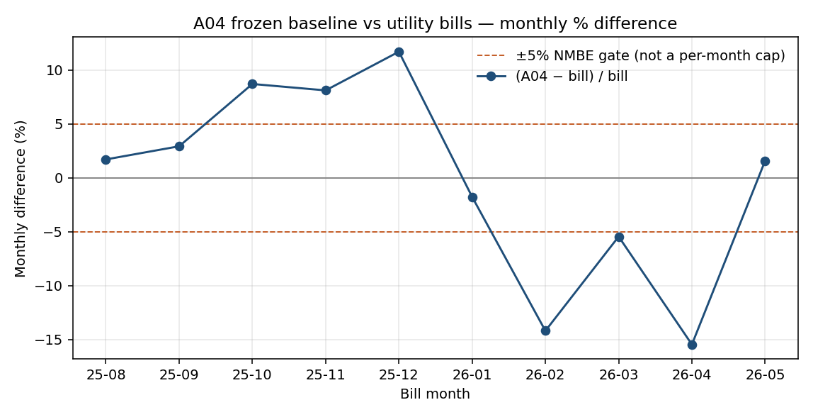
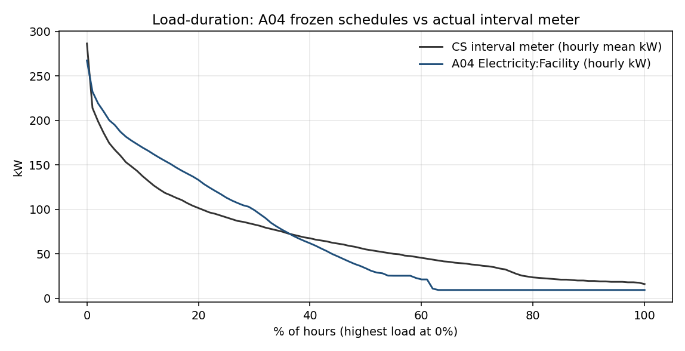
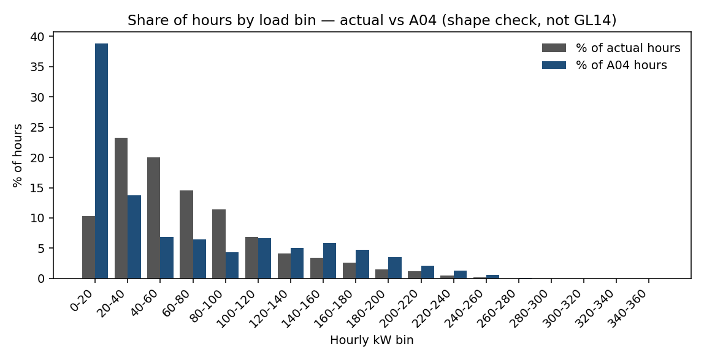

# A04 monthly Guideline 14 (frozen baseline)

GitHub renders this Markdown. The Cursor canvas ([`a04-gl14.canvas.tsx`](a04-gl14.canvas.tsx)) is the same numbers in the IDE; GitHub does not execute `cursor/canvas`.

**This is the GL14 claim.** Champion IDF `lakeside_w2a_a04_dual_champion.idf`, trial `A04_r02_sum040_clg48_augSchool` (2026-08-09). Utility billed kWh, **frozen** schedules and plant knobs. Not PPO. Not DualSP from an agent.

| Gate | Scorecard | Reconstructed from sim + bills |
| --- | ---: | ---: |
| n months | 10 (Aug 2025–May 2026) | 10 |
| NMBE | **+0.984%** | +0.981% |
| CVRMSE | **10.447%** | 10.451% |
| Pass | \|NMBE\| ≤ 5% and CVRMSE ≤ 15% | **PASS** |
| Jan-26 peak | ~287 kW | — |

Formulas: `NMBE = 100 * sum(bill − sim) / ((n−1) * mean(bill))`, `CVRMSE = 100 * sqrt(sum((bill − sim)²)/(n−1)) / mean(bill)`.

## Two tests (do not mix them)

1. **This page — frozen A04 vs bills.** Calibration. GL14 monthly.
2. **[`epw-vs-bas-3x.md`](epw-vs-bas-3x.md) — PPO/heuristic days vs CS meter.** Screening replay. Not a GL14 retest.

Passing (1) does not prove hourly shape. A bad (2) overlay does not reopen (1).

## Monthly percent difference

Dashed lines are ±5% for scale. The gate is the **10-month** NMBE/CVRMSE, not “every month inside ±5%.” Feb and Apr are the large under-predictions.

| Month | Billed kWh | A04 kWh | % diff |
| --- | ---: | ---: | ---: |
| 2025-08 | 32,789 | 33,349 | +1.71 |
| 2025-09 | 31,350 | 32,268 | +2.93 |
| 2025-10 | 32,552 | 35,386 | +8.71 |
| 2025-11 | 42,097 | 45,512 | +8.11 |
| 2025-12 | 67,328 | 75,205 | +11.70 |
| 2026-01 | 81,491 | 80,050 | −1.77 |
| 2026-02 | 67,205 | 57,669 | −14.19 |
| 2026-03 | 51,938 | 49,108 | −5.45 |
| 2026-04 | 42,296 | 35,757 | −15.46 |
| 2026-05 | 31,398 | 31,897 | +1.59 |

## Load-duration vs actual (not GL14)

Same 10 months. Actual = CS `demand_interval_kw.csv` hourly mean. A04 = `Electricity:Facility` hourly.

Peaks are close (interval hourly mean max ~287 kW, A04 ~268 kW). The curves diverge in the body of the year: A04 sits lower for a large share of hours.

## Percent of hours by load bin (profile mix)

This is the old “where does the profile live” plot — share of hours in each 20 kW bin. Not a GL14 statistic.

Actual hours pile in **20–80 kW**. A04 piles **~39% of hours in 0–20 kW** (setback / unoccupied). Monthly energy can still pass GL14. That gap is why monthly GL14 ≠ interval/DSM GO.
