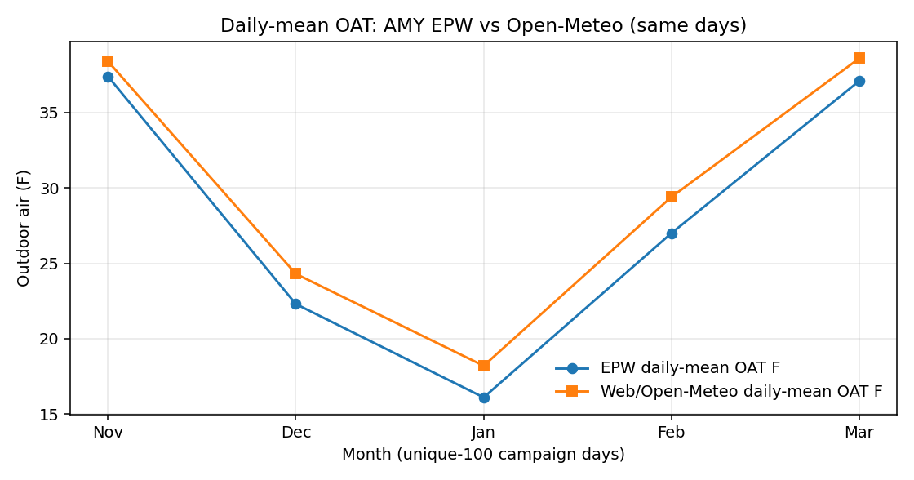
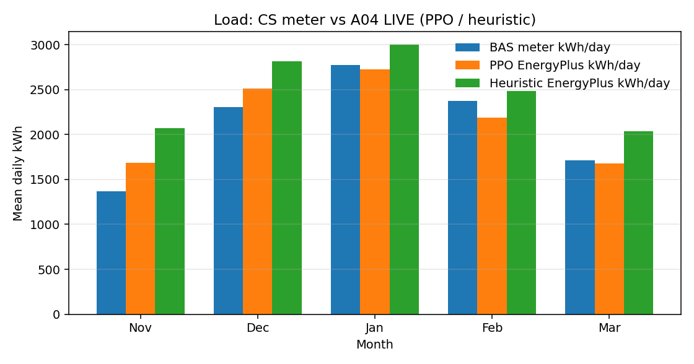

# EPW vs web weather vs BAS (unique-100)

GitHub renders this Markdown. The Cursor canvas ([`epw-vs-bas-3x.canvas.tsx`](epw-vs-bas-3x.canvas.tsx)) is the same numbers in a live IDE panel; GitHub does not execute `cursor/canvas`.

**Claim:** ENERGYPLUS DSM OPTIMIZATION SCREENING / RETROSPECTIVE REPLAY.

In this report an **EnergyPlus day** means one EnergyPlus run on A04 for one EPW date. It is **not** BAS/meter data. The code flag is still `LIVE_ENERGYPLUS` (refuse surrogates). PPO/DQN weights already sit on the site as SB3 `.zip` files; ranking leftover work does not reload those zips to keep training.

**A04 dual champion already meets Guideline 14** on the frozen-baseline calibration vs **billed monthly kWh**. Charts for that test: [`a04-gl14.md`](a04-gl14.md). The table below is **not** that test. It is PPO/heuristic **operated** EnergyPlus vs CS meter on the same 99 calendar days. Do not use it to reopen GL14.

## Weather (AMY EPW is already actual-year Open-Meteo)

Daily-mean OAT RMSE **2.3 °F**, MAE **1.9 °F**, EPW **1.8 °F cooler**. Overlap 99 of 100 unique-100 days.

## Load: CS meter vs EnergyPlus A04 (PPO / heuristic)

| Policy | Mean E+ kWh | BAS kWh | Bias | CVRMSE | r (kWh) | Peak CVRMSE |
| --- | ---: | ---: | ---: | ---: | ---: | ---: |
| PPO | 2,209 | 2,164 | +45 | 30% | 0.67 | 46% |
| DQN | 2,328 | 2,164 | +164 | 31% | 0.66 | 41% |
| Heuristic | 2,526 | 2,164 | +363 | 34% | 0.67 | 37% |
| Random walk | 2,594 | 2,164 | +430 | 37% | 0.63 | 40% |

PPO mean kWh is close to the meter; peaks run high (~175 vs ~141 kW). Random walk and heuristic burn extra kWh. Ranking in the **twin**: PPO beats random; PPO vs heuristic is close.

## 3× days

Resampling the same 99 days: PPO still beats random; PPO vs heuristic win rate ~63% at n=100 → ~76% at n=300. That is ranking precision, not a new climate.

## year2xsyn (complete; TRAIN not eval)

Site campaign `year2xsyn` finished (random 487/487, heuristic 485 ok / 2 heap fails). Repo copy: [`../rl_report_year2x/README.md`](../rl_report_year2x/README.md).

PPO/DQN jsonl is **TRAIN exploration**, not deterministic `predict()` eval. **No winner.** Saved PPO saturates lower bounds. DQN is Discrete(64) ablation.

