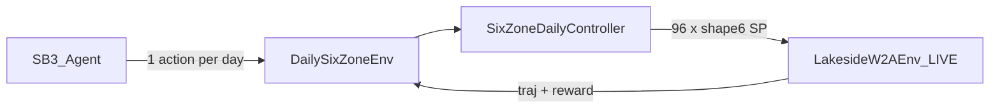

# RL daily six-zone DSM (LIVE EnergyPlus + Stable-Baselines3)

## Scientific claim (locked)

Every RL artifact and CLI banner must state exactly:

**ENERGYPLUS DSM OPTIMIZATION SCREENING / RETROSPECTIVE REPLAY**

Not operational MPC, verified savings, or BACnet. Simulator: **LIVE_ENERGYPLUS only** — no farm lookup, no surrogate, no synthetic physics.

## Locked MDP

- **Episode** = one weather day (96 scored `kind_of_sim==3` rows)
- **Action** = daily policy → [`SixZoneDailyParams`](vibe_code_apps_22/eplus_gym/six_zone_daily_controller.py): occ/unocc °F, occupancy start/end steps, recovery lead, per-zone setback offsets
- **School start** = **08:00 = step 32**; negative reward if any of 6 BAS zones cold by then
- **Reward** = `-(C_energy + C_peak) - λ_pre8 * V_pre8 - λ_occ * V_occ`; E+ fail → large negative (fail-closed)
- **Plots** = matplotlib only → `{SITE}/reports/eplus_gym/rl/<run_id>/plots/` and repo `plots/`

Aligned with [airboxlab/rllib-energyplus](https://github.com/airboxlab/rllib-energyplus) Gym+runner shape; **shipped trainer = Stable-Baselines3** (PPO continuous + DQN discrete), not RLlib.

## Keep as baseline

[`scripts/vibe22.py`](vibe_code_apps_22/scripts/vibe22.py) six-zone coordinate descent remains untouched; RL compare uses it as the honest non-RL comparator.

## Implementation order

1. Spec + `requirements-rl.txt`
2. Spaces + reward (unit tests, no E+)
3. `DailySixZoneGymEnv` (real E+)
4. Matplotlib plot helpers
5. `vibe22_rl.py` train / eval / bakeoff (all LIVE)
6. Compare vs coordinate descent
7. rllib-energyplus hygiene docs
8. LIVE acceptance campaign → commit/push only after PASS

Detailed steps: [`vibe_code_apps_22/docs/superpowers/plans/2026-08-13-rl-daily-six-zone-dsm.md`](vibe_code_apps_22/docs/superpowers/plans/2026-08-13-rl-daily-six-zone-dsm.md)

## File map (new)

| Path | Role |
| --- | --- |
| `eplus_gym/rl/daily_env.py` | 1 step = 1 LIVE day |
| `eplus_gym/rl/spaces.py` | action ↔ SixZoneDailyParams |
| `eplus_gym/rl/reward.py` | cost + pre-8AM comfort |
| `eplus_gym/rl/train_sb3.py` | SB3 PPO/DQN |
| `eplus_gym/rl/plots.py` | matplotlib savers |
| `eplus_gym/rl/compare_baseline.py` | RL vs vibe22 descent |
| `scripts/vibe22_rl.py` | CLI |
| `requirements-rl.txt` | SB3 + torch CPU |
| `vibe22_agent_spec/RL_DAILY_DSM.md` | Spec + verdict |

## Action bounds (locked)

| Channel | Bounds |
| --- | --- |
| occupied_heating_f | 68–72 °F |
| unoccupied_heating_f | 58–68 °F |
| occupancy_start_step | 20–40 |
| occupancy_end_step | 60–80 |
| recovery_lead_min | 0–180 |
| zone setback_offset_f ×6 | −3…+1 °F |

## First LIVE bakeoff budget

| Phase | Episodes | Purpose |
| --- | --- | --- |
| Smoke | 4–6 | Wiring |
| Short bakeoff | PPO 30 + DQN 30 | Algorithm signal |
| Deeper | Winner +50–100 | Stabilize |
| Holdout | 5 unseen days | Generalization |

Include `2026-01-26`. Six-zone actuation gate must be READY first.

## Out of scope

- Surrogate / lookup “RL”
- Streamlit / Plotly product UI
- BACnet / Site Config auto-promote
- Verified-tariff savings claims
- Full RLlib multi-worker (optional later)

## Done when

1. Real one-day E+ episodes with six actuators
2. PPO+DQN bakeoff artifacts + matplotlib PNGs on disk
3. RL vs coordinate-descent Jan26 comparison
4. Spec/verdict documents LIVE-only honesty
5. Unit tests for spaces/reward pass in CI without E+
