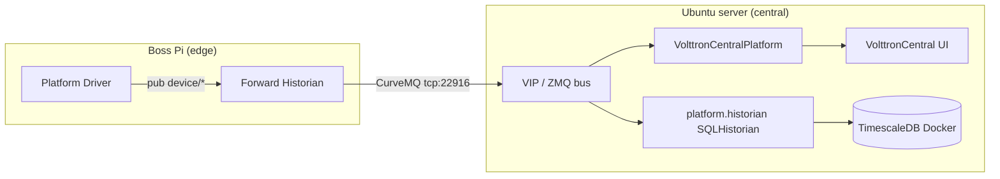

# Vibe App 9 — Ubuntu Central (TimescaleDB + VOLTTRON Central) + Pi Forward Historian (ZMQ)

This tutorial mirrors the **depth and operator-first style** of **App 8’s** `bas-lite-app8-tutorial.md`, but the product is a **multi-platform VOLTTRON** lab: **data originates on a boss Pi** (Platform Driver / BACnet or bench devices) and is **forwarded over ZMQ** to an **Ubuntu server** that runs **SQLHistorian → TimescaleDB** and **VOLTTRON Central** (official agents only — **no** custom App 8-style web agent).

**Official references (read in parallel):**

- [Multi-Platform Connection](https://volttron.readthedocs.io/en/main/deploying-volttron/multi-platform/index.html)
- [Forward Historian (ZMQ setup)](https://volttron.readthedocs.io/en/main/deploying-volttron/multi-platform/forward-historian-deployment.html)
- [ForwardHistorian README / options](https://volttron.readthedocs.io/en/main/volttron-api/services/ForwardHistorian/README.html)
- [SQLHistorian + TimescaleDB](https://volttron.readthedocs.io/en/main/volttron-api/services/SQLHistorian/README.html)
- [VolttronCentralPlatform](https://volttron.readthedocs.io/en/main/volttron-api/services/VolttronCentralPlatform/modules.html) · [VolttronCentral](https://volttron.readthedocs.io/en/main/volttron-api/services/VolttronCentral/modules.html)
- [VOLTTRON Central deployment (vcfg walkthrough)](https://volttron.readthedocs.io/en/main/deploying-volttron/multi-platform/volttron-central-deployment.html)
- [VIP Authentication](https://volttron.readthedocs.io/en/main/platform-features/message-bus/vip/vip-authentication.html)

---

## Quick context (for humans + AI)

| Role | Host | Message bus | Agents you care about |
|------|------|---------------|------------------------|
| **Central** | Fresh **Ubuntu Server** 22.04/24.04 LTS | **ZMQ** | **SQLHistorian** (`platform.historian`) → TimescaleDB · **VolttronCentralPlatform** · **VolttronCentral** (browser UI) |
| **Edge / Data collector** | **boss Pi** (or second VM) | **ZMQ** | **Platform Driver** (+ BACnet proxy as needed) · **ForwardHistorian** |
| **Database** | Same Ubuntu host as central (simplest) | — | **TimescaleDB** in Docker, port **5432** bound to **127.0.0.1** |

**Clarification on “two agents”:** VOLTTRON Central is normally **two cooperating agents** — **VolttronCentralPlatform** (instance registration / RPC bridge) and **VolttronCentral** (web UI). The **historian** is a **third** agent. Functionally you have **one database writer** + **one “Central” UI stack”**; the install count is **three** VIP identities unless you defer Central and only prove forwarding + SQLHistorian first.

| Item | Example value |
|------|----------------|
| Central hostname | `central01` (DNS or `/etc/hosts`) |
| Central VIP / ZMQ | `tcp://0.0.0.0:22916` externally reachable (see §6) |
| Central HTTPS (VC / discovery) | `https://central01:8443` after `vcfg` web setup |
| Pi hostname | `bosspi` |
| `VOLTTRON_HOME` (each machine) | `/home/<user>/.volttron` (separate on Pi vs central) |
| VOLTTRON source tree | `/home/<user>/volttron` (git clone of **VOLTTRON 9.x** matching your edge) |

Pin **the same VOLTTRON major/minor** on Pi and server (e.g. both from `releases/9.x` or the same git tag). Mixed minors sometimes work but is a common support foot-gun.

---

## 1. Architecture



**Data path:** Platform Driver publishes `devices/<device>/all` on the Pi. Forward Historian subscribes to the same topics as a normal historian, then **republishes** them on the **central** VIP bus. **SQLHistorian** on central subscribes and writes rows into **Timescale** hypertables (when `timescale_dialect: true`).

---

## 2. Prerequisites

- Two machines on a **routable LAN** (or VPN): **Ubuntu server** + **Raspberry Pi** (or VM).
- **Python 3.10+** on both (VOLTTRON 9 expectation).
- **Git**, **build-essential**, **libffi-dev**, OpenSSL tooling (follow [platform install](https://volttron.readthedocs.io/en/main/introduction/platform-install.html) for your exact distro).
- **Docker Engine** + **Docker Compose v2** on **central only** (simplest Timescale path for newcomers).
- Firewall rules drafted before you start:
  - **Central:** inbound **22916/tcp** from Pi only (or from admin subnet); **8443/tcp** for HTTPS UI if you use VC over the network; **do not** expose PostgreSQL publicly.
  - **Pi:** outbound to central **22916**; BACnet UDP **47808** as already required for field gear.

---

## 3. TimescaleDB on central (Docker)

On the **Ubuntu server**:

```bash
sudo apt update
sudo apt install -y docker.io docker-compose-v2
sudo usermod -aG docker "$USER"
# log out and back in so docker group applies
```

Copy the compose file from this repo:

`vibe_code_apps_9/docker/docker-compose.timescale.yml`

```bash
mkdir -p ~/volttron-stack/timescale
cd ~/volttron-stack/timescale
cp /path/to/py-bacnet-stacks-playground/vibe_code_apps_9/docker/docker-compose.timescale.yml .
cp /path/to/py-bacnet-stacks-playground/vibe_code_apps_9/docker/.env.example .env
# edit .env — set a long random POSTGRES_PASSWORD
docker compose -f docker-compose.timescale.yml up -d
docker compose -f docker-compose.timescale.yml ps
```

Verify:

```bash
docker exec -it volttron_timescale psql -U volttron -d volttron -c "SELECT version();"
```

You should see PostgreSQL + Timescale extension lines.

**Why loopback binding:** the compose file publishes `127.0.0.1:5432:5432` so only processes on **central** (VOLTTRON) reach the DB. If you ever move the DB to another host, use **private IP + firewall**, not a public RDS without TLS and network policy.

---

## 4. Install VOLTTRON on central (ZMQ)

High-level steps (align with official **platform install** for your tag):

```bash
cd ~
git clone https://github.com/VOLTTRON/volttron.git
cd volttron
git checkout releases/9.x   # or a specific 9.x tag you standardized on
python3 -m venv env
source env/bin/activate
pip install --upgrade pip wheel
pip install .
./bootstrap.sh --developer   # if your tag still uses it; otherwise follow current README
```

Create a **systemd** unit or use `volttron -vv -l ... &` for testing. Production pattern matches App 8 §8: dedicated user, `RuntimeDirectory`, journald.

**Message bus:** choose **ZMQ** during `vcfg` (see next section). Do **not** follow RabbitMQ multi-platform pages for this tutorial.

---

## 5. Configure central with `vcfg` (web + Central + historian hook)

The fastest *guided* path is `vcfg` on the **central** host, similar to the [VOLTTRON Central deployment](https://volttron.readthedocs.io/en/main/deploying-volttron/multi-platform/volttron-central-deployment.html#getting-started) example:

- Message bus: **zmq**
- **Web enabled:** **yes** (HTTPS on **8443** is typical) — enables **`/discovery/`** for optional forwarder auto-setup.
- **This instance is VOLTTRON Central:** **yes** (installs **VolttronCentral** + walks VC admin bootstrap).
- **Controlled by VOLTTRON Central:** **yes** for the *central* instance’s **VolttronCentralPlatform** pairing to itself / admin URL.
- **Historian:** you may let `vcfg` install a default **SQLHistorian**; you will **re-point** it to Timescale in §7 (or skip historian in `vcfg` and install manually — both are valid).

**Bind addresses:** edit `$VOLTTRON_HOME/config` so external hosts can open VIP and HTTPS:

- VIP listener must be reachable as `tcp://<central_lan_ip>:22916` from the Pi.
- Web bind must allow `https://<central_lan_ip>:8443` if you browse from your workstation.

Exact keys vary slightly by VOLTTRON version; compare your generated `config` against the **instance external address** guidance in [multi-platform router / external address](https://volttron.readthedocs.io/en/main/deploying-volttron/multi-platform/multi-platform-router.html#platform-external-address-configuration) and your platform’s `volttron -h` / docs.

Restart the platform after edits:

```bash
vctl shutdown --platform
# start volttron again via systemd or your supervisor
```

---

## 6. SQLHistorian → TimescaleDB

### 6.1 Python dependency

On **central**, inside the VOLTTRON venv:

```bash
source ~/volttron/env/bin/activate
pip install psycopg2-binary
```

### 6.2 Historian config

Use `examples/central/sqlhistorian.config.example.json` in this repo as a template. Important keys per [SQLHistorian README](https://volttron.readthedocs.io/en/main/volttron-api/services/SQLHistorian/README.html#timescaledb-support):

- `"type": "postgresql"`
- `"timescale_dialect": true` inside `params`

Install or update the agent (paths follow a typical source checkout — adjust if your tree differs):

```bash
cd ~/volttron
source env/bin/activate
export VOLTTRON_HOME=~/.volttron

# If historian not installed yet:
vctl install services/core/SQLHistorian \
  --tag platform_historian \
  --vip-identity platform.historian \
  --agent-config /path/to/sqlhistorian.config.json

# If already installed, update config file on disk then:
vctl restart --tag platform_historian
```

**Sanity check:** historian logs should show successful DB connection, not auth errors.

```bash
docker exec -it volttron_timescale psql -U volttron -d volttron -c "\dt"
```

You should see historian tables (names depend on sqlhistorian version / `tables_def`).

---

## 7. VolttronCentralPlatform + VolttronCentral

If `vcfg` already installed them with autostart, confirm:

```bash
vctl status
```

You expect **healthy** entries for identities similar to `volttroncentral`, `vcplatform` (exact names depend on version / prompts).

Complete **VC admin** setup in the browser at:

`https://<central_lan_ip>:8443/admin/login.html`

(self-signed cert → browser warning is normal in labs).

**Security:** the [VolttronCentral README](https://volttron.readthedocs.io/en/main/volttron-api/services/VolttronCentral/README.html#security-considerations) discusses auth hardening — treat the lab password as disposable.

---

## 8. Boss Pi: collectors (no historian required on Pi)

Bring up **BACnet proxy + Platform Driver** (and devices) the same way as **App 7 / App 8** (`vibe_code_apps_6` `RECREATE.md`, `vibe_code_apps_8` tutorial). The Pi must **publish** `devices/...` topics.

**Do not** install a second SQLHistorian on the Pi for this architecture — the **central** historian is the sink.

Optional: `examples/ListenerAgent` or tail logs to prove publishes if driver is idle.

---

## 9. Forward Historian on the Pi (ZMQ → central)

### 9.1 Pick a configuration style

Per [Forward Historian deployment](https://volttron.readthedocs.io/en/main/deploying-volttron/multi-platform/forward-historian-deployment.html#configuring-forwarder-agent):

**Option 1 — explicit VIP + server key (recommended for learning):**

```json
{
  "destination-vip": "tcp://CENTRAL_LAN_IP:22916",
  "destination-serverkey": "PASTE_FROM_CENTRAL"
}
```

On **central**:

```bash
source ~/volttron/env/bin/activate
export VOLTTRON_HOME=~/.volttron
vctl auth serverkey
```

Copy the key into the Pi’s forwarder config (`examples/edge/forward-historian.config.example.json`).

**Option 2 — HTTPS discovery (`destination-address`):**

If central web is up with a reachable HTTPS URL, you can use:

```json
{ "destination-address": "https://CENTRAL_LAN_IP:8443" }
```

See `examples/edge/forward-historian.config.web-discovery.example.json` and the [README option 2](https://volttron.readthedocs.io/en/main/volttron-api/services/ForwardHistorian/README.html#configuration-options).

### 9.2 Wait for historian on central

Add to the forwarder config:

```json
"required_target_agents": ["platform.historian"]
```

So the forwarder **buffers** until `platform.historian` is connected on the destination, avoiding silent drops during startup ordering.

### 9.3 Install forwarder on Pi

```bash
cd ~/volttron
source env/bin/activate
export VOLTTRON_HOME=~/.volttron

vctl install services/core/ForwardHistorian \
  --tag forwarder \
  --vip-identity forwarder \
  --agent-config /path/to/forward-historian.config.json

vctl start --tag forwarder
```

(Adjust `--vip-identity` / tag to your naming standard.)

---

## 10. Authorize the Pi forwarder on **central** (mandatory for ZMQ)

The **destination** must accept the **source** Curve credentials. Per [forward historian deployment — destination configuration](https://volttron.readthedocs.io/en/main/deploying-volttron/multi-platform/forward-historian-deployment.html#configuring-destination-volttron-instance):

On **central**:

```bash
vctl auth add
```

Provide:

- **Address:** the Pi’s **IP** (or CIDR if your policy allows) — this is the **incoming TCP** peer address the central broker sees.
- **Credentials:** the **public key** of the **forwarder agent** (or the credential string format your `vctl auth` version expects).

On **Pi**, inspect keys / agent identity help:

```bash
vctl auth publickey
# If your shell requires specifying the forwarder agent, use vctl --help and your version's flags
```

If you are **only in a throwaway lab**, the official VC demo sometimes uses a **wide-open credentials regex** — that is **insecure** and should never face production OT:

```text
# INSECURE CLASSROOM ONLY — do not use on real sites
vctl auth add --credentials "/.*/"
```

Prefer **per-agent** keys once you confirm the pipeline works.

After `auth add`, restart forwarder if it was error-looping:

```bash
vctl restart --tag forwarder
```

---

## 11. Prove end-to-end data flow

1. **Pi:** confirm driver publishes (`vctl status`, driver logs, or BACnet read).
2. **Central logs:** you should see device traffic **after** forwarder auth succeeds.
3. **Database:** query recent rows (table names may vary):

```bash
docker exec -it volttron_timescale psql -U volttron -d volttron -c \
  "SELECT COUNT(*) FROM data;"
```

If counts increase, **ForwardHistorian + SQLHistorian + Timescale** are aligned.

4. **VOLTTRON Central UI:** register the remote **platform** (Pi) if you are following the full VC multi-instance story from the [deployment doc](https://volttron.readthedocs.io/en/main/deploying-volttron/multi-platform/volttron-central-deployment.html#remote-platform-configuration) — VC is optional for *raw historian proof* but is part of App 9’s learning goals.

---

## 12. Troubleshooting checklist

| Symptom | Likely cause |
|---------|----------------|
| Forwarder “auth failed” / disconnect loop | Missing or wrong **`vctl auth add`** on central; wrong **Pi IP** in address rule; clock skew (rare). |
| Forwarder connects, central historian empty | Historian DB credentials wrong; Timescale not up; **`required_target_agents`** blocking until historian crashes. |
| Cannot open VC HTTPS | Firewall; bind address still **localhost**; self-signed cert not trusted — OK for lab. |
| High latency / backlog | Forward historian is **live-forward**, not a batch bulk mover — for huge catch-up, see [DataMover Historian](https://volttron.readthedocs.io/en/main/agent-framework/historian-agents/data-mover/data-mover-historian.html) in official docs. |

---

## 13. What not to do on the central server (scope guardrails)

For the **App 9 teaching topology**:

- **No** Platform Driver on central (keep BACnet off the historian box unless you have a deliberate reason).
- **No** App 8 `ben.app8.web` agent — visualization is **VOLTTRON Central** + DB tools (Grafana optional, out of scope).
- **No** RabbitMQ path in this document — if you need RMQ multi-platform, start from [multi-platform index](https://volttron.readthedocs.io/en/main/deploying-volttron/multi-platform/index.html) item 3+ instead.

---

## 14. Files in this repo to copy verbatim

| File | Use on |
|------|--------|
| `docker/docker-compose.timescale.yml` | Central |
| `docker/.env.example` | Central → copy to `.env` |
| `examples/central/sqlhistorian.config.example.json` | Central → edit password/host |
| `examples/edge/forward-historian.config.example.json` | Pi → VIP + serverkey |
| `examples/edge/forward-historian.config.web-discovery.example.json` | Pi → HTTPS discovery |

---

## 15. Relationship to App 8

| Topic | App 8 | App 9 |
|-------|--------|--------|
| Primary UX | React **BAS Lite** in `ben.app8.web` | **VOLTTRON Central** web + DB queries |
| Historian | In-agent / in-memory trends (bench) | **Enterprise SQLHistorian** → **TimescaleDB** |
| Multi-platform | Not the focus | **ForwardHistorian** + **ZMQ auth** core lesson |
| Edge | boss Pi BACnet + driver | **Same Pi story**, adds **forward** config |

You can run **App 8 UI on the Pi** and **App 9 central stack** in parallel on different hosts; they are orthogonal concerns — just avoid duplicate historians on the same logical “sink” unless you intend it.
